# StoryBoard

#### Proposal ID : **NITK_PALS21_037**

#### Experiment Name : ***Amplitude Modulation and Demodulation***

#### Story Outline:
##### **This experiment focuses on understanding the principle of amplitude modulation & demodulation.  This experiment is formulated to study the performance of various types of amplitude modulation schemes (DSB-FC, DSB-SC & SSB) for different modulation index and also its impact on modulated signal can be analyzed. Furthermore, the  modulation index, efficacy and the   total transmitted power for each category of the amplitude modulation can be estimated and verified.**

#### Story:

##### **The simulator workspace comprises blocks that the end user may drag and drop into the workspace according to a predefined procedure. Amplitude modulation may be done in three ways: DSB-FC, DSB-SC, and SSB-SC. The user can start with the block connections based on the type of modulation he or she prefers. When selecting the sine wave generator block, the end user may input their preferred values for the attributes (fixed amplitude, frequency, etc.) in the corresponding fields (Amplitude, Frequency).While performing each subcategory of amplitude modulation, the user may observe the power and modulation index for each subcategory by clicking on the relevant modulation/demodulation blocks. The modulation index can also be classified as over , under, or critical modulation by the simulator. For demodulation, under each category, demodulation blocks are made available and may be dragged & dropped in the workspace by the user , and the connections are established  based on the instructions mentioned in the  procedure ,so as to extract the message signal from the modulated signal of the category. The simulator also calculates the efficacy of amplitude modulation/demodulation under each subcategory using the original message signal and the message signal extracted from the modulated signal.**

#### Set User Objectives & Goals:

##### **1) Understand the principle of amplitude modulation (AM) and demodulation.**
##### **2) Select the type of sinusoidal signal to be used as modulating and carrier signal.**
##### **3) Recall the conditions for perfect modulation and choose the amplitude and frequency of the modulating and carrier signal by satisfying the conditions (fc>>fm and Ac >>Am).**
##### **4) Calculate the modulation index (mu) and check whether under modulation condition is satisfied for   perfect recovery of signal at the receiver end.**
##### **5) Analyze the AM modulation for different modulation indices (mu=1, mu>1 & mu<1).**
##### **6) Analyze the types of AM such as DSB-FC, DSB-SC and SSB-SC in time  domain.**  
##### **7) Calculate the total power consumption and efficiency for all the types of amplitude modulation scheme for performance comparison.**

#### Pathway activities:

##### **1) The students will have to browse through the theory and procedure by navigating to theory icon and clicking on it, so as  to guide the student in  performing the process of simulating amplitude modulation & demodulation with ease.**
##### **2) The students should then choose  an appropriate value as the input signal frequency so that the input signal modulates the carrier signal with proper amplitude and frequency values.**
##### **3) The students would then compute the modulation index manually for the specified inputs manually and compare the same with the simulation generated modulation index (purely for improving conceptual clarity in the topic).**
##### **4) The students would then  be  given the liberty to choose the type of modulation based on the layout diagram prescribed for the type and record the output for the same.**

##### **5)The students should then calculate the power values for all the types of modulation and find the efficiency and conclude the best modulation technique based on the computed values(manually& compare the same with the simulation generated values) for the same.**

#### Set Challenges and Questions/Complexity/variation
### **Pre Test Section :**

#### **Note**:
##### ***These questions are asked to examine the Theoretical knowledge absorbed by the user  during the theory class.***
##### ***Please do answer all the questions below within the allocated time to avoid any errors.***

##### Number of Questions:10
##### Question Pattern: MCQ

#### **Quick Quiz**
##### 1.	What is the need of modulation?
 ***A.	Reduces the antenna height***

 B.	Increases the antenna height

 C.	Short distance communication

 D.	Increase the interference power

##### 2.	What are the types of analog modulation schemes?
 A.	Phase modulation

 B.	Frequency modulation

 C.	Amplitude modulation

 ***D.	 All of the above***

##### 3.	Identify the characteristics of Amplitude modulation.
 A.	Modulating signal amplitude is varied w.r.t carrier signal

***B. Carrier signal amplitude is varied w.r.t modulating signal***

 C.	Modulated signal amplitude remains constant.

 D.	Modulated signal frequency and phase also varying

#####  4.	What is the bandwidth requirement of DSB-SC and SSB?
 A.	fm & fm

 B.	fm & 2fm

 C.	4fm & 2fm

***D.	2fm & fm***

##### 5.	For under modulation, what is the value of modulation index?
 A.	m= 1

 B.	m>1

 ***C.	m<1***

 D.	m=0

##### 6.	The process of retrieving modulating signal from the modulated wave is called as
 A.	Modulation

 ***B.	Detection***

 C.	Multiplexing

 D.	Demultiplexing

##### 7.	The modulating signal is not preserved from the envelope of an AM signal If modulation index is
***A.	greater than 1***

 B.	Less than 1

 C.	Equal to 1

 D.	Equal to 0

##### 8.	What is the maximum transmission efficiency of DSB-FC?
A : 44.4%

B: 55.5%

***C: 33.33%***

D: 64.44%

##### 9.	Identify the drawback of SSB modulation.
***A.	Carrier to be locally generated at the receiver***

B.	High bandwidth

C.	High transmit power

D.	Low efficiency

##### 10.	Define Modulation index of AM
 A.	Ac/Am

 ***B.	Am/Ac***

 C.	2Am/Ac

 D.	Am/2Ac

### **Post Test Section**
#### **Note**:
##### ***These questions are asked to check the knowledge attained by the user after performing the experiment.***
##### ***Please do answer all the questions below within the allocated time to avoid any errors.***

##### Number of Questions:10
##### Question Pattern: MCQ

#### **Quick Quiz**

##### 1. The frequency and amplitude of the carrier signal should be _______ compared to baseband signal.
 ***A.	Greater than***

 B.	Less than

 C.	Equal to

 D.	None of the Above

##### 2. Point the condition to be satisfied for modulation without any distortion in practice.
 A.	m=1

***B.	m<1***

C.	m>1

 D.	m=0

##### 3. How do you eliminate the occurrence of carrier signal in the generation of DSB-SC waveform?
 ***A.	Multiplying carrier and modulating signal***

 B.	Adding carrier and modulating signal

 C.	Subtracting modulating signal from the carrier signal

 D.	Adding the mean value of modulating and carrier signals

##### 4. Which among the following modulation technique is more efficient?
 A.DSB-FC

 B.DSB-SC

 ***C.SSB-SC***

D. Both B&C

##### 5. How do you retrieve the modulating signal from DSB-FC signal?
 A.    Balanced modulator

B.     Switching modulator

***C.      Envelope detector***

 D.      Square law modulator

##### 6. The DSB-FC spectrum consists of:
 A. Upper sideband only

 B. Lower sideband only

 C. Carrier frequency only

 ***D. All of the Above***

##### 7. Identify the modulation scheme that uses more bandwidth and transmitted power.
 ***A.	DSB-FC***

B.	DSB-SC

C.	SSB-SC

D.	Both A&B

##### 8. Calculate the total transmitted power of DSB-FC modulated signal with the carrier power of 8 W and modulation index of 0.5.
 A. 4W

 ***B. 9W***

 C. 7W

 D. 8W

##### 9. The modulating signal frequency and the carrier frequency of an AM broadcast station are 5KHz & 20KHz respectively. Calculate the upper & lower sideband frequencies and the total bandwidth.
 A. 20KHz, 30KHZ, 5KHz

 B. 10KHz, 5KHz, 10KHz

 ***C. 25KHz, 15KHz, 10KHz***

 D. 40KHz, 20KHz, 5KHz

##### 10. Find the total modulation Index of AM system when a carrier wave is modulated by two modulating signals with modulation indices 0.4 and 0.3.
A. 0.3

B. 0.4

C. 0.25

***D. 0.5***

#### Conclusion:

##### By doing the above experiment the user would get familiarized with the below points

**1. Display of modulating, carrier signals, Modulated (DSB-FC, DSB-SC, SSB-SC) and demodulated    waveforms in time domain.**

**2. Calculation of modulation index, carrier power, sideband powers, total power, and efficiency.**

**3. Verification of degrees of modulation (over, under, critical)**

##### **Time required to perform the virtual experiment.**
***The approximate time required to understand the procedure to perform the experiment would take about 5 min. To connect the circuit for AM modulation & demodulation will take another 5 min. Analyzing the practical output with theory calculations (Power estimation) will take 5 min. Answering the assessment questions will take about 5 min. Thus, the total time required to perform the experiment will require around 20 min.***

#### Equations/formulas:

| **Theory**     | **Formulae** |   **Description**|
| :-----------: | :------------: | :-----------: |
|**Total power/Modulation Index Calculation for DSB-FC:**     | **Pt=Pc[1+(mu x mu)/2],N=[(mu x mu)/2+(mu x mu)]**  |   **Pc🡪 Carrier signal Power,Pt🡪 Total Power of DSB-FC Signal,mu🡪 Modulation Index,N 🡪Efficiency**|
| **Total power /Modulation Index Calculation for DSB-SC:**   | **Pt’=[(mu x mu)  x (VC x VC)]/4=>Pc x (mu x mu)/2,N= [2/2+(mu x mu)]**      |       **Pc🡪  Carrier signal Power,Pt’🡪 Total Power of DSB-SC Signal,mu🡪 Modulation Index,N 🡪Efficiency**|
| **Total power/Modulation Index Calculation for SSB/SSB-SC:**   | **Pt’’=[(mu x mu)  x (VC x VC)]/8=>Pc x (mu x mu)/4,N=[4+(mu x mu)/4+(2 x (mu x mu))]**      |       **Pc🡪  Carrier signal Power,Pt’🡪 Total Power of DSB-SC Signal,mu🡪 Modulation Index,N 🡪Efficiency**          |

#### Flowchart:

#### Mindmap:

## **Storyboard:**
### **Procedure:**
##### **Equipment’s/Components Required:**

|    **Name of equipment/component**   | **Quantity required/used** |
| :---:        |    :----:   |  
| **1)Wave Generator/Sine wave Generator block**     | **2**      |
| **2) Balanced Modulator block**   | **1**       |
| **3)Adder block**   | **1**       |
| **4)Side Band Suppress Filter (SSBF)/Filter block**   | **1**       |
| **5)Envelope Detector block**   | **1**       |
| **6)SSB Demodulator block**   | **1**       |
| **7)DSB-SC Demodulator block**   | **1**       |
| **8)Output Block**   | **as per user's requirements (min:3)**       |

#### **Step by Step Procedure to perform experiment**

##### **A)Amplitude Modulation**

##### **Step1:** The user should Click on the theory under which the concept behind the working of the experiment would be displayed followed by the procedure which would be displayed in the screen, so that the user could perform the Amplitude modulation (AM) and demodulation experiment based on the guidelines listed under the procedure.

#####  **Step2**:Once the user performs Step1, then the user should avail the “Edit” option, after which the select/drop function blocks (which are uniformly categorized in the toolbox pane (which would be situated in the left pane) would be displayed to the user, based on which the user could use the select/drop function offered by the blocks where the user would initially select their desired block and could place them in the workspace.

##### **Step3:** Once the user performs Step2, then the user could perform the type of Amplitude Modulation/Demodulation from the various block layout diagram displayed under the Amplitude Modulation Procedure (at the end). These types include.

    DSB-FC -“Double Sideband Full Carrier System”
    DSB-SC – “Double Sideband Suppressed Carrier System”
    SSB – “Single Side Band System”

##### **Step4:** Once the user performs Step 4, then the user could very well single click on the wave generator  blocks(carrier and message signal) and tune the respective parameters like (varying the amplitude, frequency of both the message & carrier signal by entering the values under the category which would then yield the desired output to the user during the execution of the experiment.

**Note: The Frequency and Amplitude of Carrier Signal must be higher than the frequency and amplitude of the message signal.**

##### Tuning the parameters of the Wave Generator before placing the block

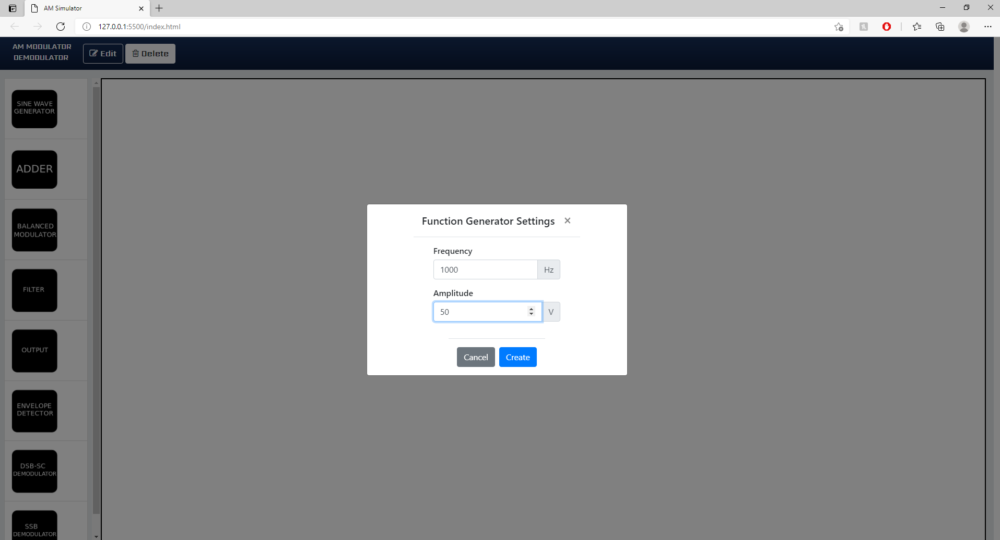

##### Tuning the parameters of the Wave Generator after placing the block

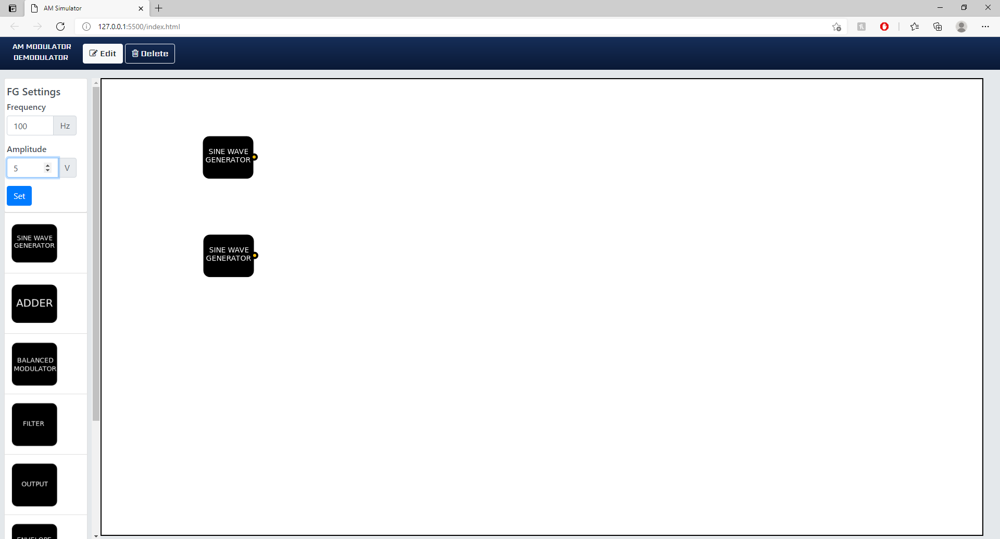

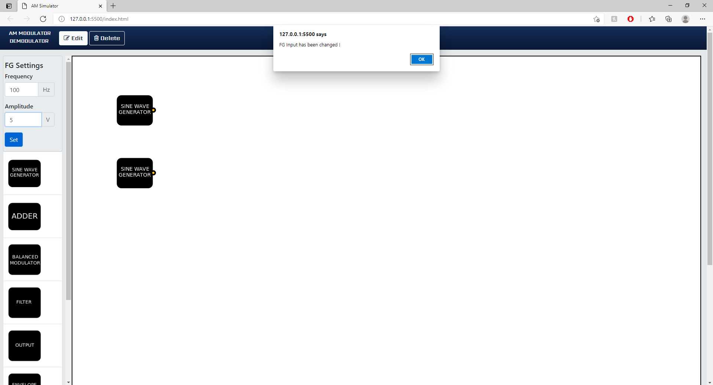

##### **Step5:**  Once the user performs Step 4, then the user could then connect the blocks using the connecting wires option (which would come into play as soon as the edges/nodes of the blocks are clicked) as per the guidelines/circuit diagram/layout diagram depicted under the Amplitude Modulation(at the end).

##### Sample wiring layout for connecting the various blocks:

##### **Step6:** Once the user performs Step 5, then the user could simulate the amplitude modulation by navigating through the respective output blocks (DSB-FC: Adder,DSB-SC: Balanced Modulator ,SSB: Filter) which would then start the simulation by compiling the design i.e. (Checking for  any loose connections between the blocks, etc) ,once the Compilation of the design model is completed then the output  waveform would be displayed along with signal power. For Information about modulation index, classification of  the type of modulation(based on the below categories)would be displayed at the output of Balanced modulator block.

    Over modulation,
    Under modulation  
    Critical modulation

##### **Sample Input waveforms required to perform process of  Amplitude Modulation:**

##### Sample Input for the  carrier signal (FG1):

##### Sample Input for the  message signal (FG2):

##### **Sample Output waveforms depicting the  process of  Amplitude Modulation:**

##### Sample output for DSB-FC:

##### Sample output for DSB-SC:

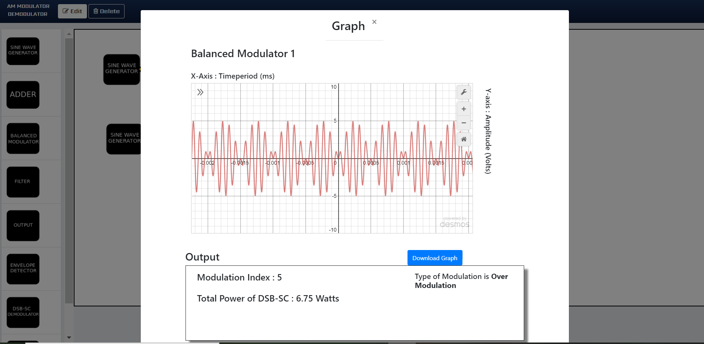

##### Sample output for SSB:

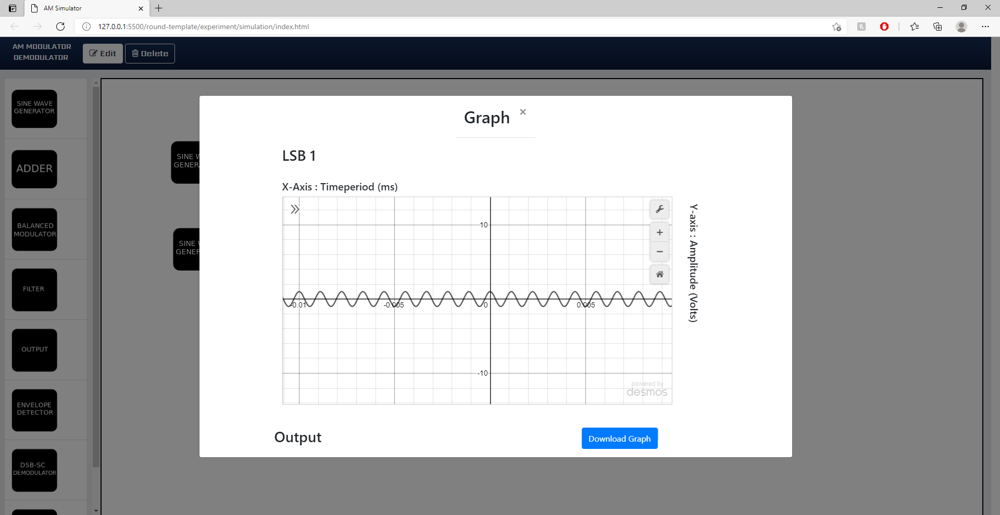

##### **Step7:** Once the user performs Step 6,then the user has successfully performed the Amplitude Modulation and the below Figure depicts the workspace to perform the experiment of Amplitude Modulation.

##### Amplitude Modulation process Workflow:

##### Amplitude Modulation Workspace:

#### Note :

##### **1) In the Simulator to view the  DSB-SC Waveform as output do click on the Balanced Modulator block**

##### **2) In the Simulator to view the  DSB-FC Waveform as output do click on the adder block**

##### **3) In the Simulator to view the  SSB Waveform as output do click on the filter block**

##### **4) To view parameters like Power and efficiency of the type of modulation kindly click on the output block of each of the subcategory**

##### **B)Amplitude Demodulation**

##### **Step1:** Once the user performs the Amplitude Modulation, then the user would be directed to a the same page where the user should avail the “Edit” option after which the select/drop function blocks (which are uniformly categorized in the toolbox pane situated in the left ) would be displayed to the user,  based on which the user could use the select/drop function offered by the blocks where the user would initially select their desired block and could place them in the workspace  based on the layout of demodulation depicted under the Amplitude Demodulation Procedure (at the end) .

##### **Step2:** Once the user performs Step 1, then the user could then connect the blocks using the connecting wires option  (which would come into play as soon as the edges of the blocks/nodes are clicked) as per the guidelines/circuit diagram / layout diagram depicted under the Amplitude Demodulation(at the end).

##### Sample wiring layout for connecting the various blocks:

#####  **Step3:** Once the user performs Step 2,  then the user has to click on the "output" blocks which  would simulate the amplitude demodulation i.e. automatically the compilation of  the design would commence i.e. (Checking for any loose connections between the blocks, etc), once the Compilation of the design model is completed then the output process i.e., the extraction of the modulated signal from the modulating signal. Would be performed and the output which is the modulated signal (a.k.a message signal).

##### **Sample output waveforms depicting the process of  Amplitude Demodulation:**

##### Sample output waveform for Demodulation of a for DSB-FC waveform:

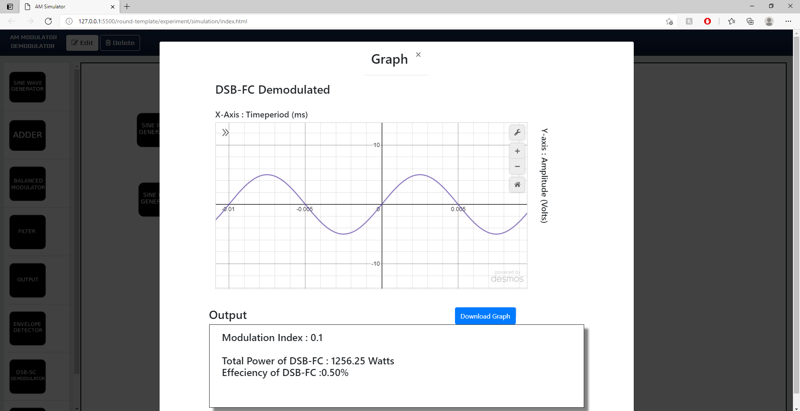

##### Sample output waveform for Demodulation of a DSB-SC waveform:

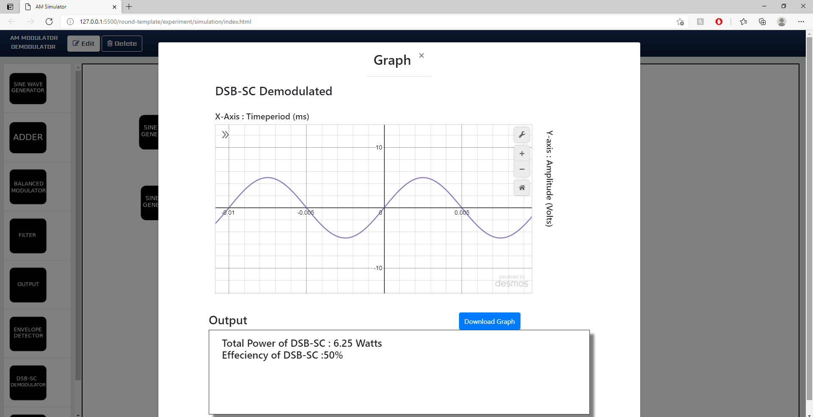

##### Sample output waveform for Demodulation of a  SSB  waveform:

##### **Step4:** Once the user performs Step 3, then the user has successfully performed the Amplitude Demodulation and the below figure depicts the workspace to perform the experiment of Amplitude Demodulation.

##### Amplitude Demodulation process Workflow:

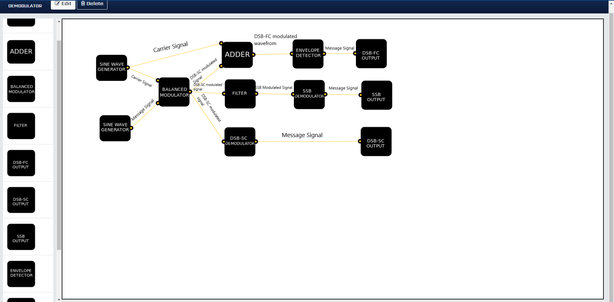

##### Amplitude Demodulation Workspace:

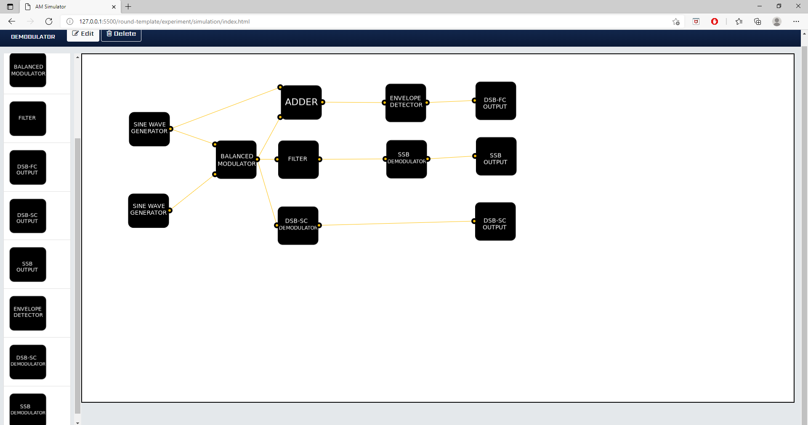

##### Note :
**1)In this simulator both the  demodulator blocks as well as output blocks for each sub category of Amplitude Modulation and Demodulation would be present, the difference between the blocks is that the function of the demodulator block would be to showcase the demodulated output  (input  message signal) and to provide the theoretical understanding of the concept, whereas the output block's main function is to showcase the demodulated waveform along with the extracted parameters from the process of amplitude modulation and demodulation such as   modulation index, total power and efficiency for each type of modulation.**

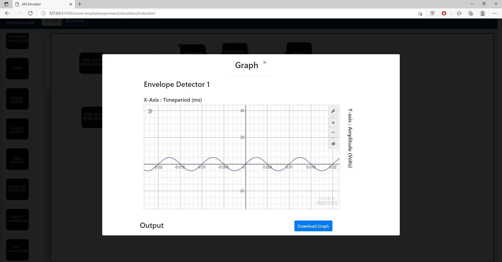

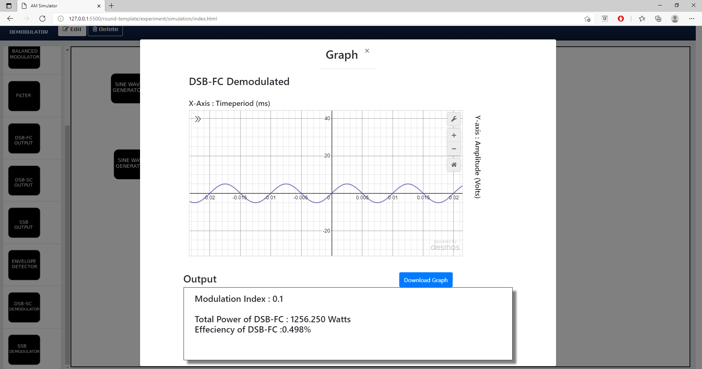

**2)As an added feature we have taken the liberty to display the output waveform for each stage so as to enhance the student's understanding on the function of blocks ,to view the output of any block at any time ,the user has to just click on the block which would then display the desired output to the user.**

**3)To alter the axis values for graphs during modulation scheme , the user just has to click on the Balanced Modulator block, Adder block and the filter block  after which the user should click on the graph tools and then avail the spanner icon option after which the user can input the new axis values for which the updated graph with new axis values would be displayed to the user.**

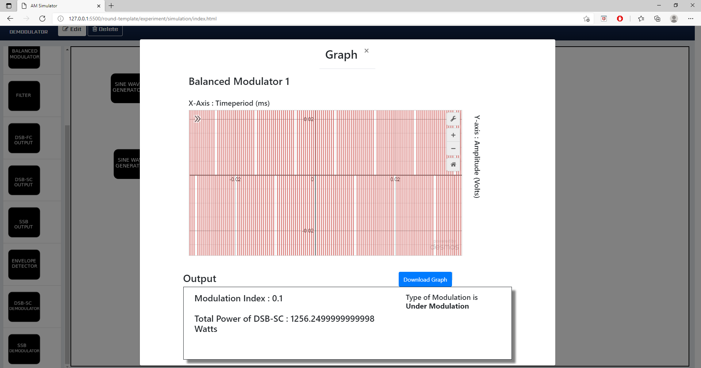

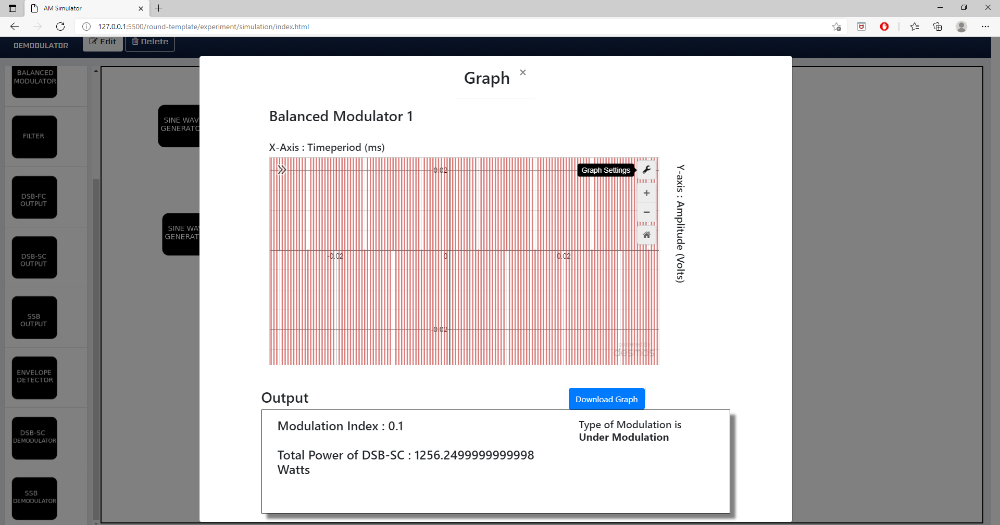

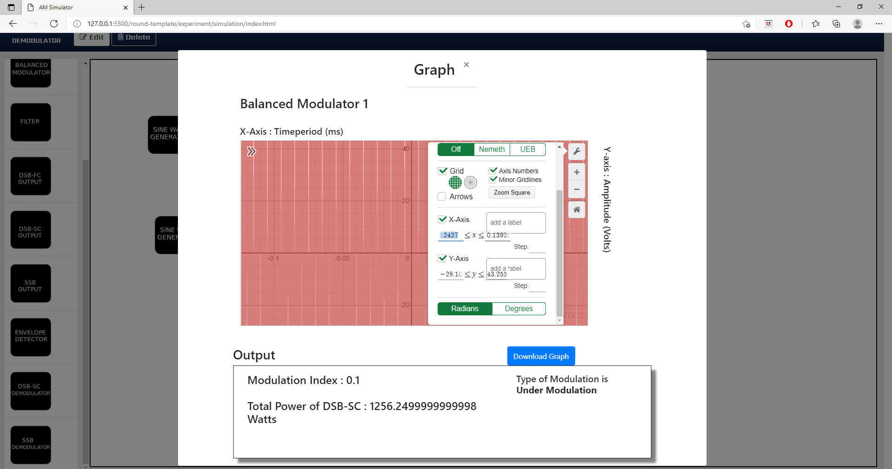

**4)To alter the axis values for graphs during demodulation scheme , the user just has to click on the any output block present in the workspace and then click on the graph tools and then avail the spanner icon option after which the user can input the new axis values for which the updated graphs with new axis values would be displayed to the user under each block present in the demodulation workspace(not including blocks in the modulation workspace).**

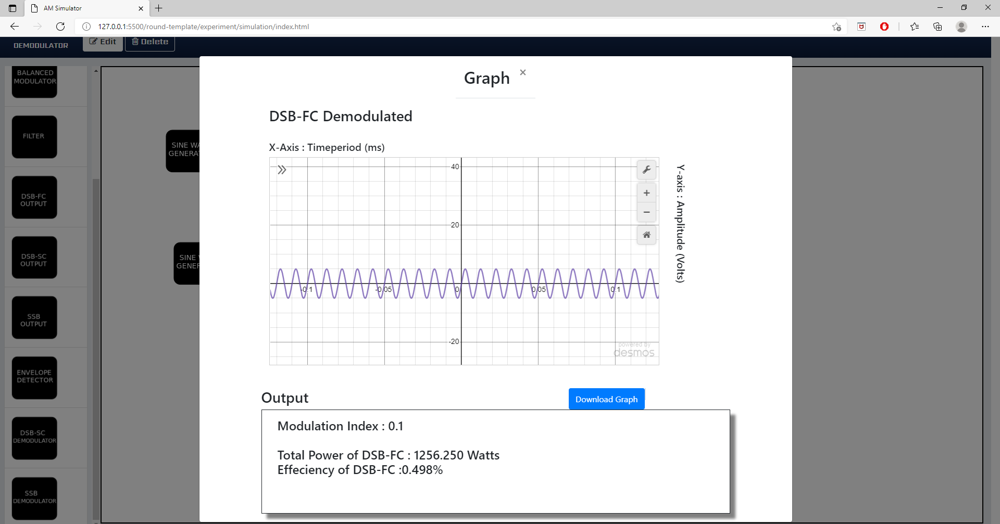

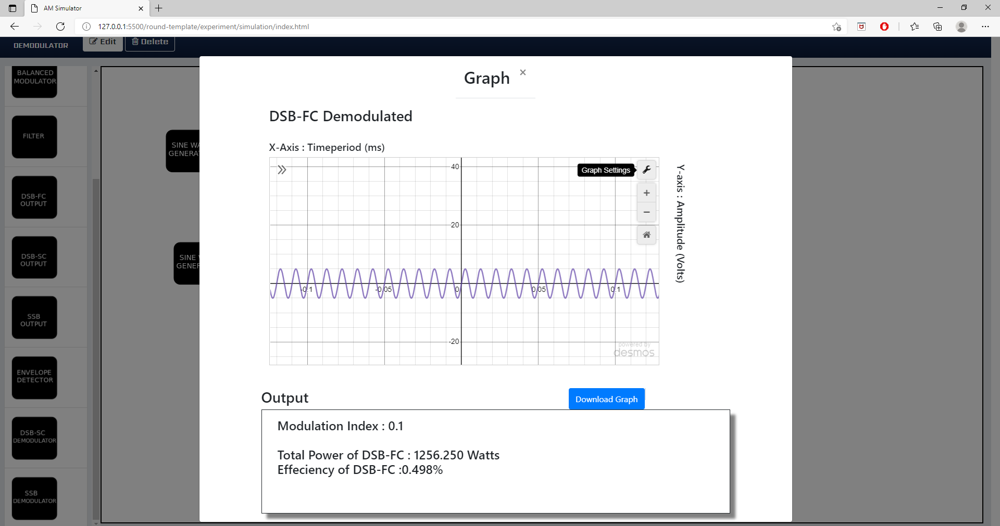

**5)Also as an added feature we have taken the liberty to create two new features move and delete whose function would help  in the movement of blocks across the workspace and delete any unnecessary blocks if need be.**

**6)To move a block the user must first choose the particular block via long press and then drag them to the desired position along the workspace pane under the edit mode .**

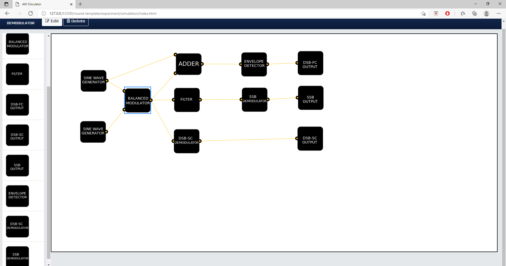

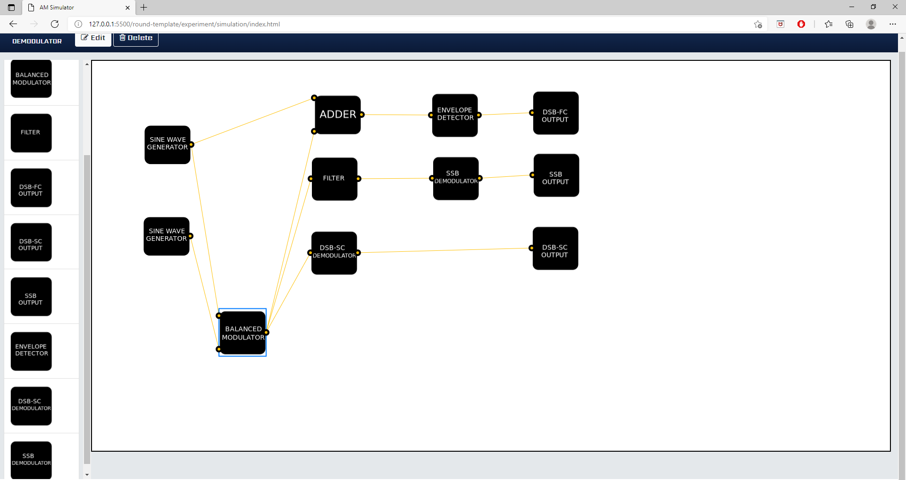

**7)To delete unwanted blocks the user must first choose the delete option  under the tool pane and then the user could select the particular blocks which need to be deleted .**

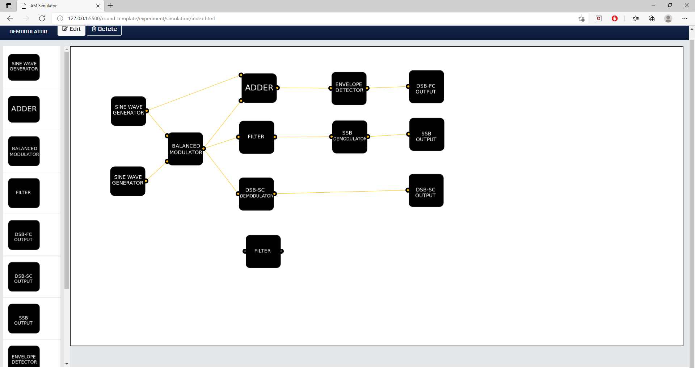

**8)During the verification of graphs if the user feels the expression pane to be a hindering their view of the entire view of the graph , then the user could perform the steps mentioned below to remove the same.**

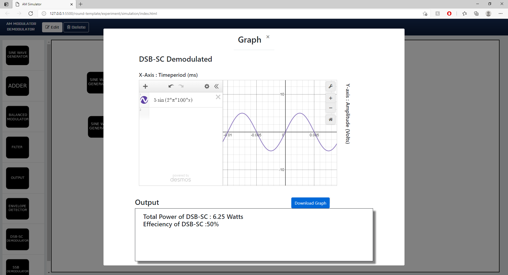

**9)During the verification of the output graphs the user would be redirected to a Formative Quiz where the user must answer the question in order to progress with later stages in  the simulation.**

##### **Example**
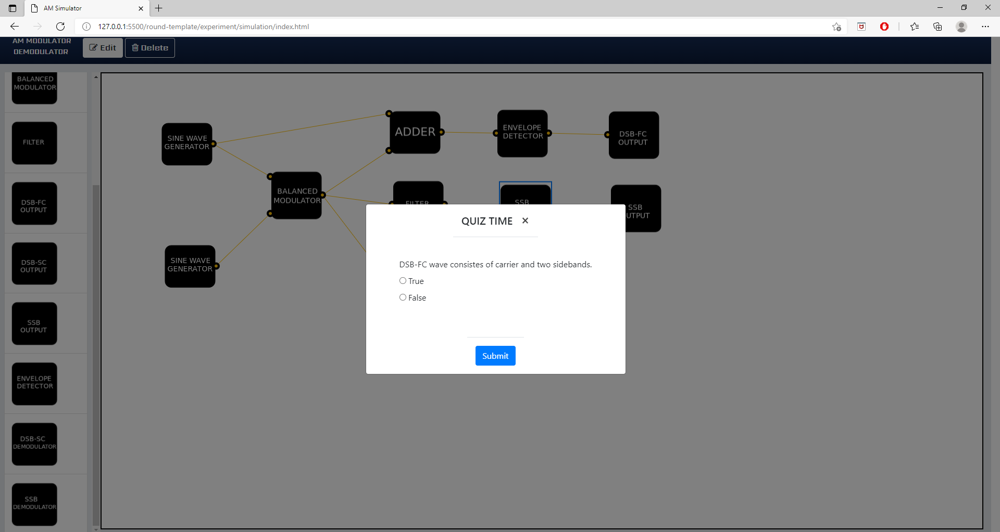

**10)Also as an added feature we have taken the liberty to include the "Download Graph" option at each block ,which could be availed by the user so as to aid in calculations to be performed by the user and future references.**

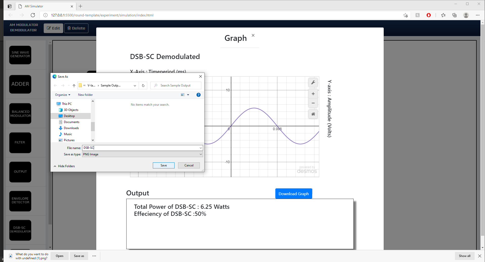

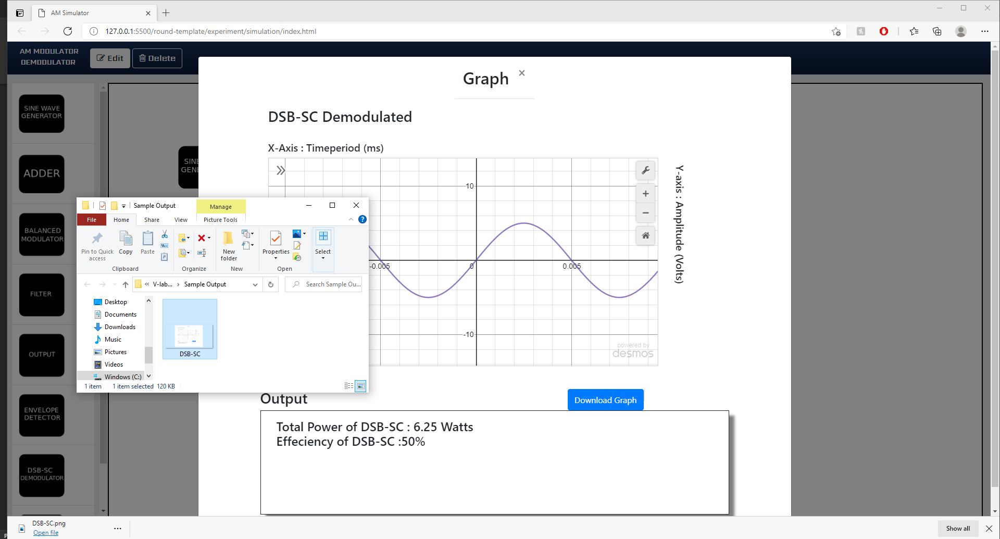

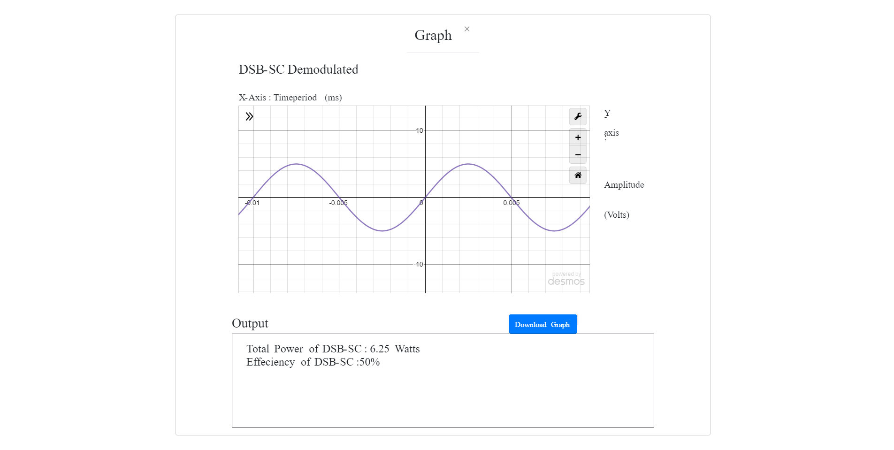
