### **Procedure:**

##### **Equipment’s/Components Required**

|    **Name of equipment/component**   | **Quantity required/used** |
| :---:        |    :----:   |  
| **1)Wave Generator/Sine wave Generator block**     | **2**      |
| **2) Balanced Modulator block**   | **1**       |
| **3)Adder block**   | **1**       |
| **4)Side Band Suppress Filter (SSBF)/Filter block**   | **1**       |
| **5)Envelope Detector block**   | **1**       |
| **6)SSB Demodulator block**   | **1**       |
| **7)DSB-SC Demodulator block**   | **1**       |
| **8)Output Block**   | **as per user's requirements (min:3)**       |

#### **Step by Step Procedure to perform experiment**

##### **A) Amplitude Modulation**

##### **Step1:** The user should Click on the theory under which the concept behind the working of the experiment would be displayed followed by the procedure which would be displayed in the screen, so that the user could perform the Amplitude modulation (AM) and demodulation experiment based on the guidelines listed under the procedure.

#####  **Step2:**:Once the user performs Step1, then the user should avail the “Edit” option, after which the select/drop function blocks (which are uniformly categorized in the toolbox pane (which would be situated in the left pane) would be displayed to the user, based on which the user could use the select/drop function offered by the blocks where the user would initially select their desired block and could place them in the workspace.

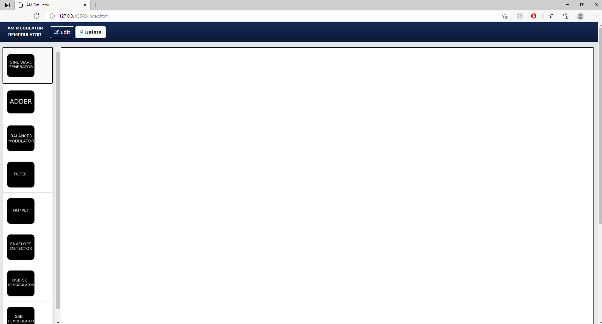

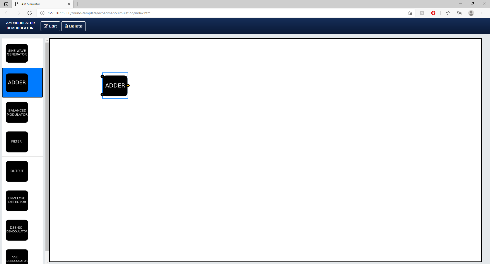

##### **Step3:** Once the user performs Step2, then the user could perform the type of Amplitude Modulation/Demodulation from the various block layout diagram displayed under the Amplitude Modulation Procedure (at the end). These types include.

    DSB-FC -“Double Sideband Full Carrier System”
    DSB-SC – “Double Sideband Suppressed Carrier System”
    SSB – “Single Side Band System”

##### **Step4:** Once the user performs Step 3, then the user could very well single click on the wave generator  blocks(carrier and message signal) and tune the respective parameters like (varying the amplitude, frequency of both the message & carrier signal by entering the values under the category which would then yield the desired output to the user during the execution of the experiment.

**Note: The Frequency and Amplitude of Carrier Signal must be higher than the frequency and amplitude of the message signal.**

##### Tuning the parameters of the Wave Generator before placing the block

##### Tuning the parameters of the Wave Generator after placing the block

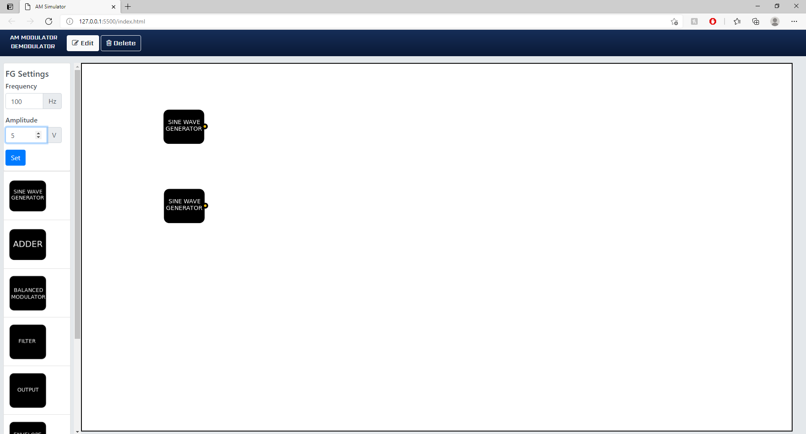

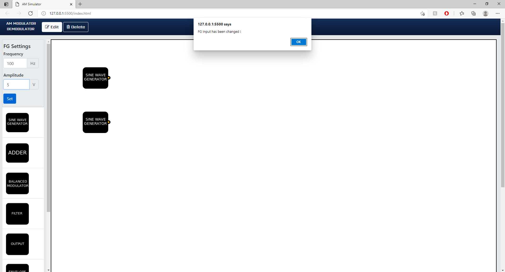

##### **Step5:** Once the user performs Step 4, then the user could then connect the blocks using the connecting wires option (which would come into play as soon as the edges/nodes of the blocks are clicked) as per the guidelines/circuit diagram/layout diagram depicted under the Amplitude Modulation(at the end).

##### Sample wiring layout for connecting the various blocks:

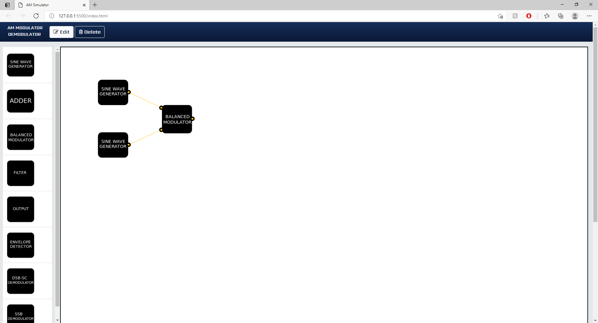

##### **Step6:** Once the user performs Step 5, then the user could simulate the amplitude modulation by navigating through respective output blocks (DSB-FC: Adder ,DSB-SC: Balanced Modulator, Filter: SSB) and then double click on the the block which would then start the simulation by compiling the design i.e. (Checking for  any loose connections between the blocks ,etc) ,once the Compilation of the design model is completed then the output  waveform would be displayed under each block .For Information about modulation index, classification of  the type of modulation(based on the below categories)would be displayed at the output of Balanced modulator block.

    Over modulation,
    Under modulation,
    Critical modulation

##### **Sample Input waveforms required to perform process of  Amplitude Modulation**

##### Sample Input for the  carrier signal (FG1):

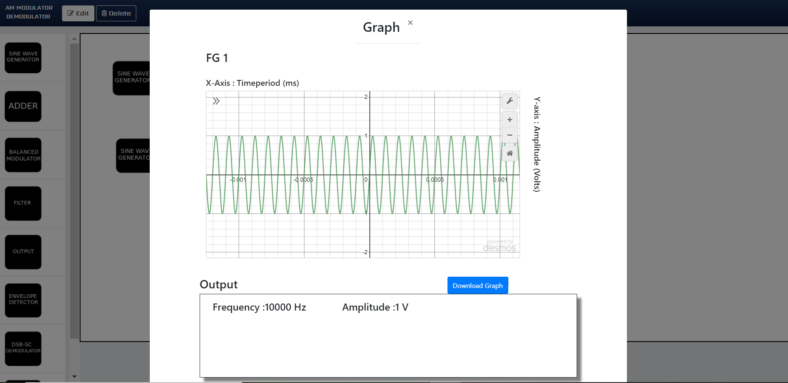

##### Sample Input for the  message signal (FG2):

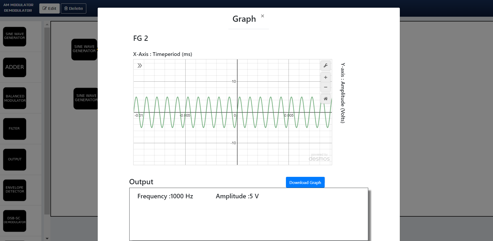

##### **Sample Output waveforms depicting the  process of  Amplitude Modulation**

##### Sample output for DSB-FC:
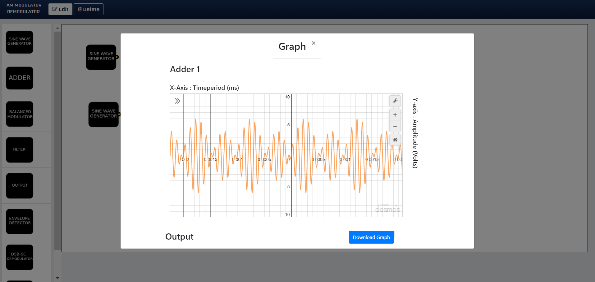

##### Sample output for DSB-SC:

##### Sample output for SSB:

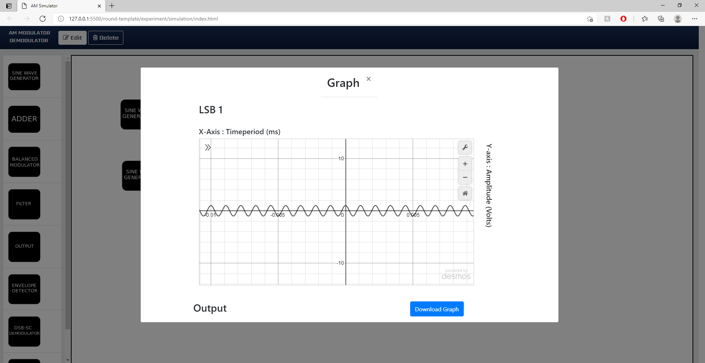

##### **Step7:** Once the user performs Step 6,then the user has successfully performed the Amplitude Modulation and the below Figure depicts the workspace to perform the experiment of Amplitude Modulation.

##### Amplitude Modulation process Workflow:

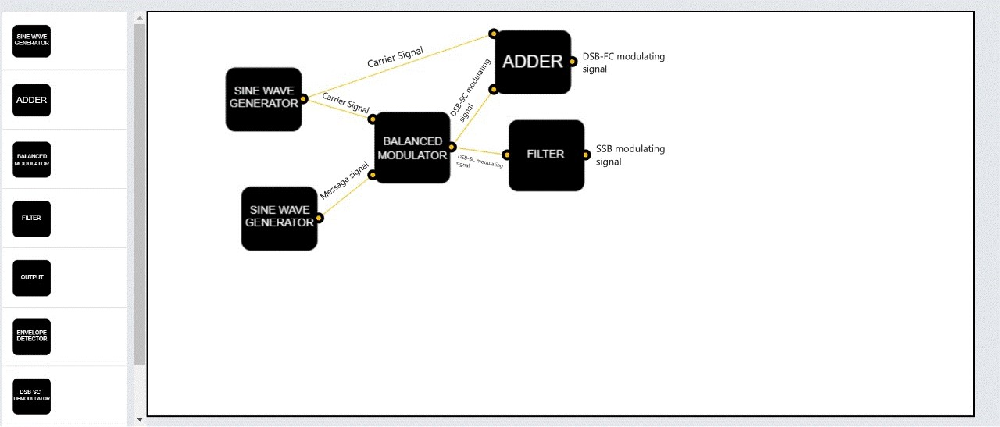

##### Amplitude Modulation Workspace:

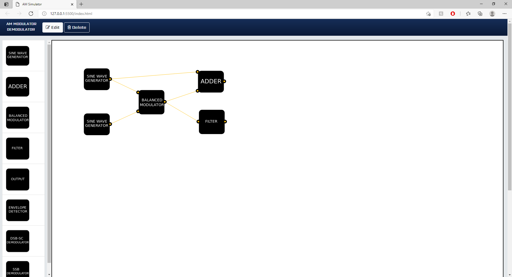

#### Note :

##### **1) In the Simulator to view the  DSB-SC Waveform as output do click on the Balanced Modulator block**

##### **2) In the Simulator to view the  DSB-FC Waveform as output do click on the adder block**

##### **3) In the Simulator to view the  SSB Waveform as output do click on the filter block**

##### **4) To view parameters like Power and efficiency of the type of modulation kindly click on the output block of each of the subcategory**

##### **B) Amplitude Demodulation**

##### **Step1:** Once the user performs the Amplitude Modulation, then the user would be directed to a the same page where the user should avail the “Edit” option after which the select/drop function blocks (which are uniformly categorized in the toolbox pane situated in the left ) would be displayed to the user,  based on which the user could use the select/drop function offered by the blocks where the user would initially select their desired block and could place them in the workspace  based on the layout of demodulation depicted under the Amplitude Demodulation Procedure (at the end) .

##### **Step2:** Once the user performs Step 1, then the user could then connect the blocks using the connecting wires option  (which would come into play as soon as the edges of the blocks/nodes are clicked) as per the guidelines/circuit diagram / layout diagram depicted under the Amplitude Demodulation(at the end).

##### Sample wiring layout for connecting the various blocks:

#####  **Step3:** Once the user performs Step 2, then the user has to click on the "output" blocks which  would simulate the amplitude demodulation i.e. automatically the compilation of  the design would commence i.e. (Checking for any loose connections between the blocks, etc), once the Compilation of the design model is completed then the output process i.e., the extraction of the modulated signal from the modulating signal. Would be performed and the output which is the modulated signal (a.k.a message signal).

##### **Sample output waveforms depicting the process of  Amplitude Demodulation**

##### Sample output waveform for Demodulation of a for DSB-FC waveform:

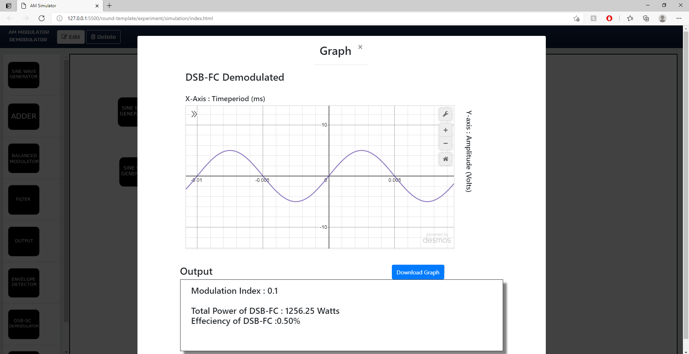

##### Sample output waveform for Demodulation of a DSB-SC waveform:

##### Sample output waveform for Demodulation of a  SSB  waveform:

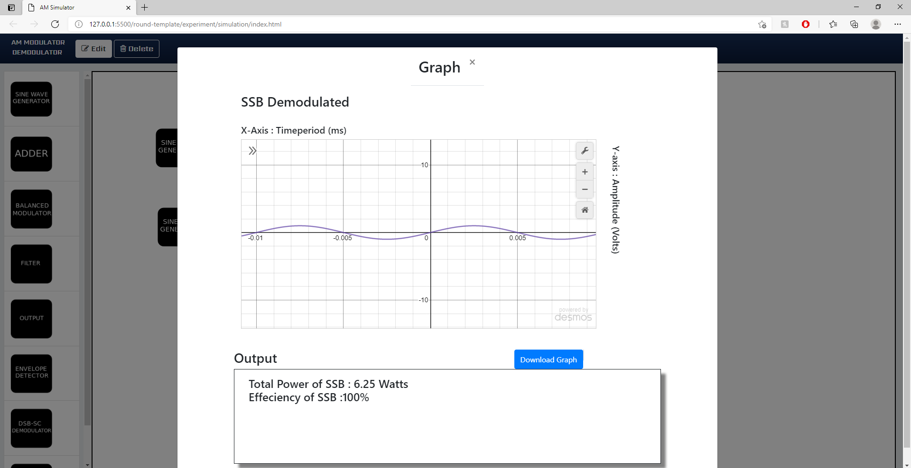

##### **Step4:** Once the user performs Step 3, then the user has successfully performed the Amplitude Demodulation and the below figure depicts the workspace to perform the experiment of Amplitude Demodulation.

##### Amplitude Demodulation process Workflow

##### Amplitude Demodulation Workspace

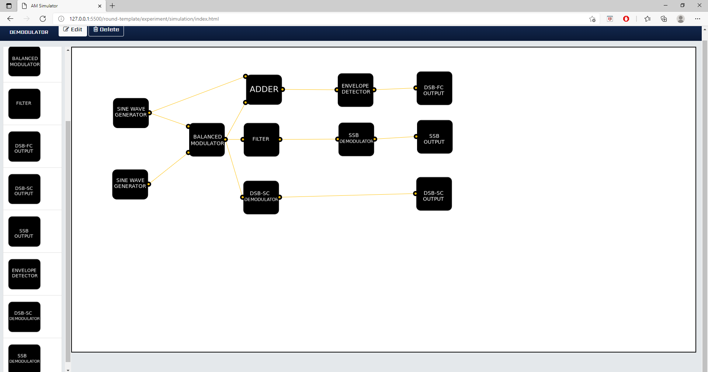

##### Note

**1)In this simulator both the  demodulator blocks as well as output blocks for each sub category of Amplitude Modulation and Demodulation would be present, the difference between the blocks is that the function of the demodulator block would be to showcase the demodulated output  (input  message signal) and to provide the theoretical understanding of the concept, whereas the output block's main function is to showcase the demodulated waveform along with the extracted parameters from the process of amplitude modulation and demodulation such as   modulation index, total power and efficiency for each type of modulation.**

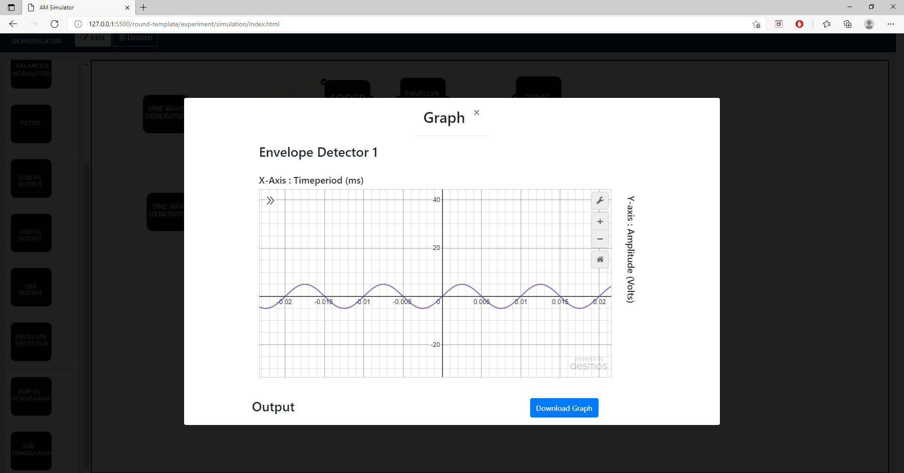

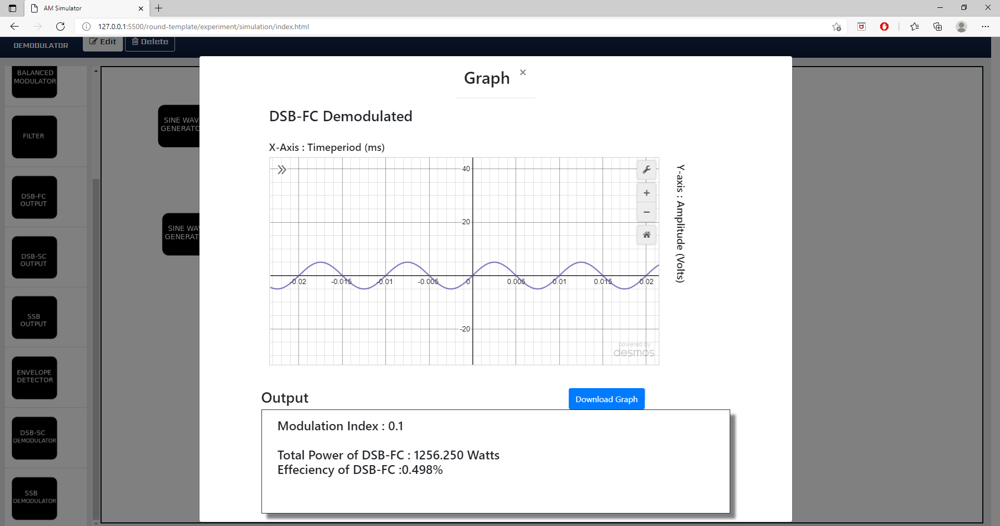

**2)As an added feature we have taken the liberty to display the output waveform for each stage so as to enhance the student's understanding on the function of blocks ,to view the output of any block at any time ,the user has to just click on the block which would then display the desired output to the user.**

**3)To alter the axis values for graphs during modulation scheme , the user just has to click on the Balanced Modulator block, Adder block and the filter block  after which the user should click on the graph tools and then avail the spanner icon option after which the user can input the new axis values for which the updated graph with new axis values would be displayed to the user.**

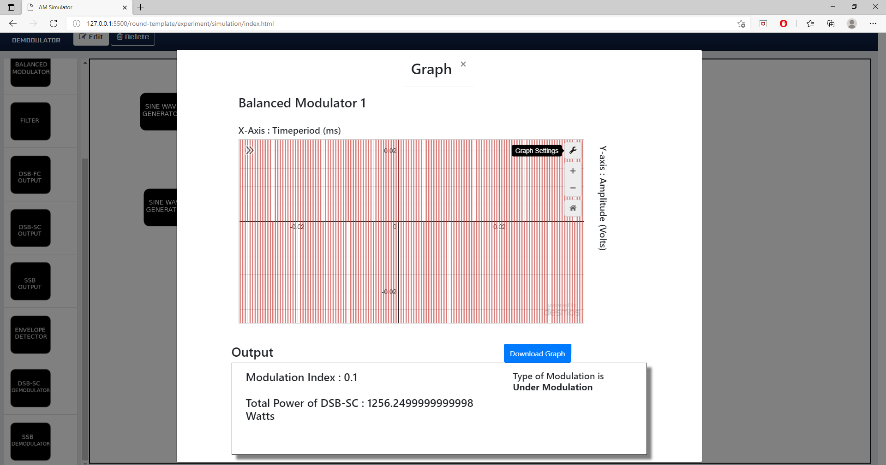

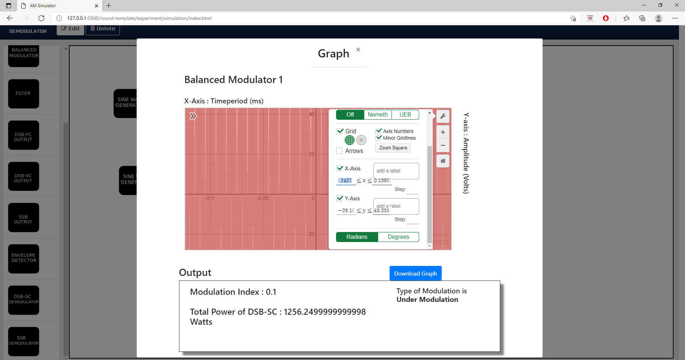

**4)To alter the axis values for graphs during demodulation scheme , the user just has to click on the any output block present in the workspace and then click on the graph tools and then avail the spanner icon option after which the user can input the new axis values for which the updated graphs with new axis values would be displayed to the user under each block present in the demodulation workspace(not including blocks in the modulation workspace).**

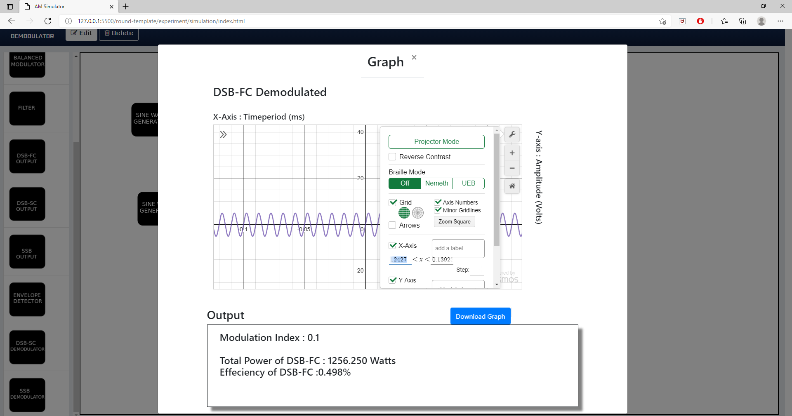

**5)Also as an added feature we have taken the liberty to create two new features move and delete whose function would help  in the movement of blocks across the workspace and delete any unnecessary blocks if need be.**

**6)To move a block the user must first choose the particular block via long press and then drag them to the desired position along the workspace pane under the edit mode .**

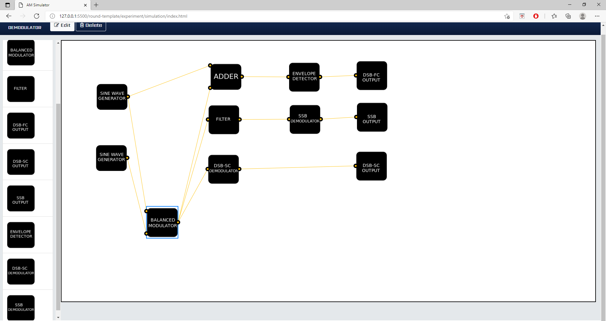

**7)To delete unwanted blocks the user must first choose the delete option  under the tool pane and then the user could select the particular blocks which need to be deleted .**

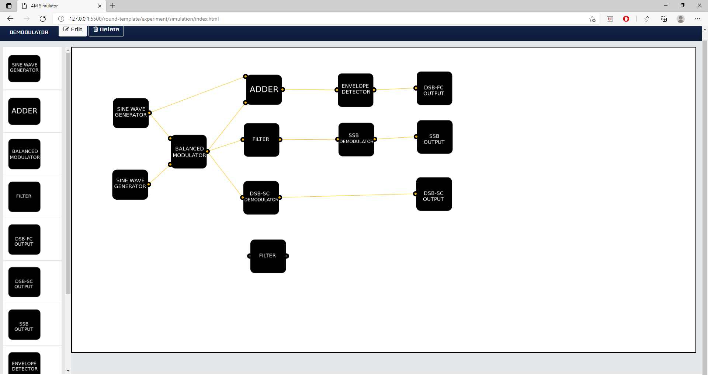

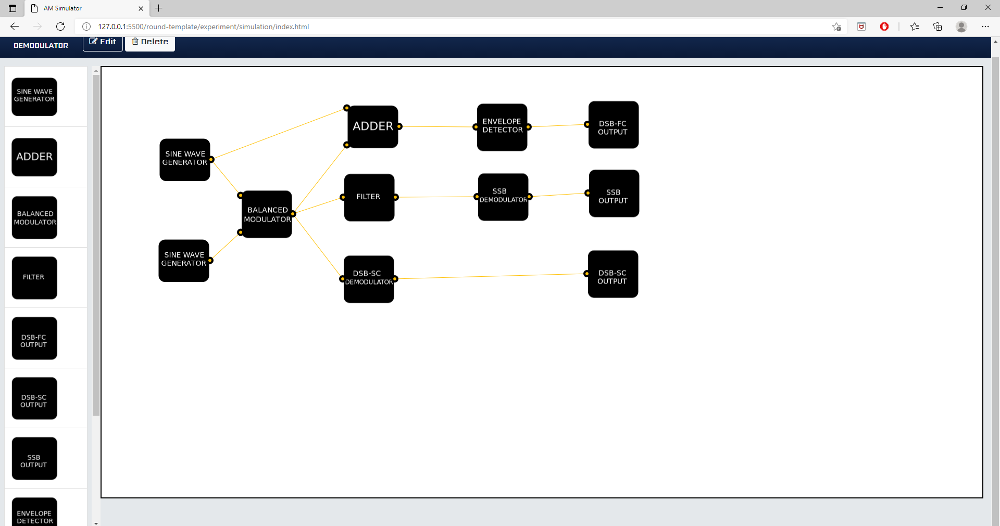

**8)During the verification of graphs if the user feels the expression pane to be a hindering their view of the entire view of the graph , then the user could perform the steps mentioned below to remove the same.**

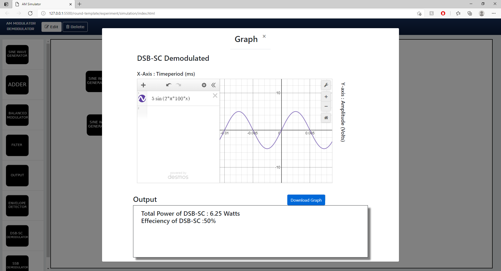

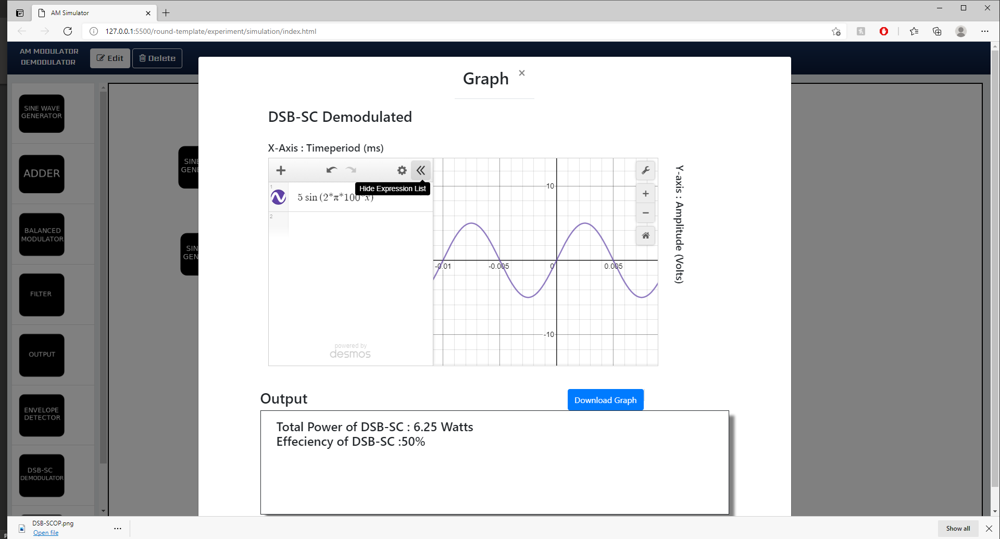

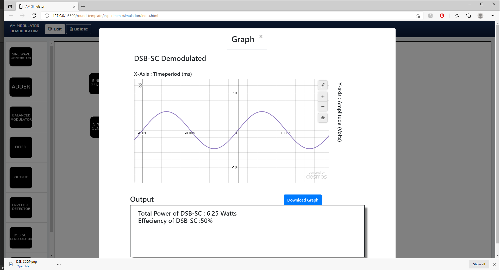

**9)During the verification of the output graphs the user would be redirected to a Formative Quiz where the user must answer the question in order to progress with later stages in  the simulation.**

##### **Example**

**10)Also as an added feature we have taken the liberty to include the "Download Graph" option at each block ,which could be availed by the user so as to aid in calculations to be performed by the user and future references.**

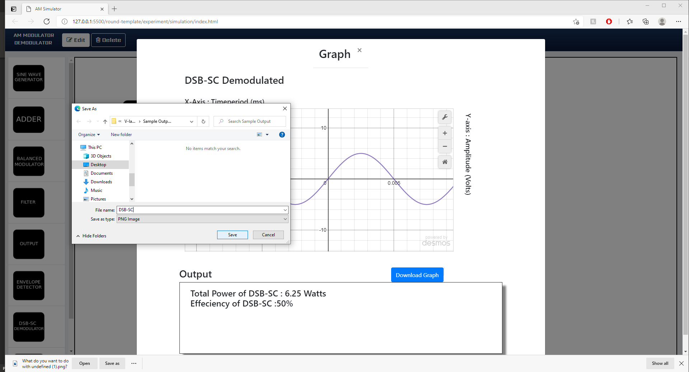

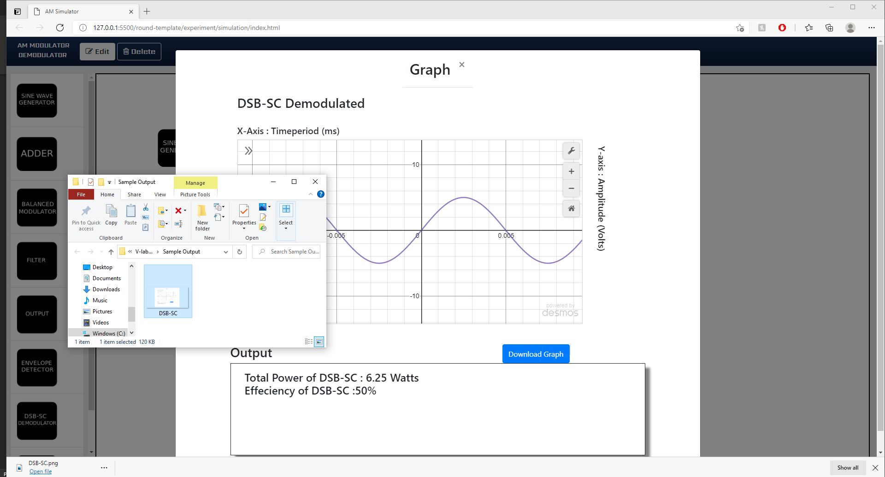

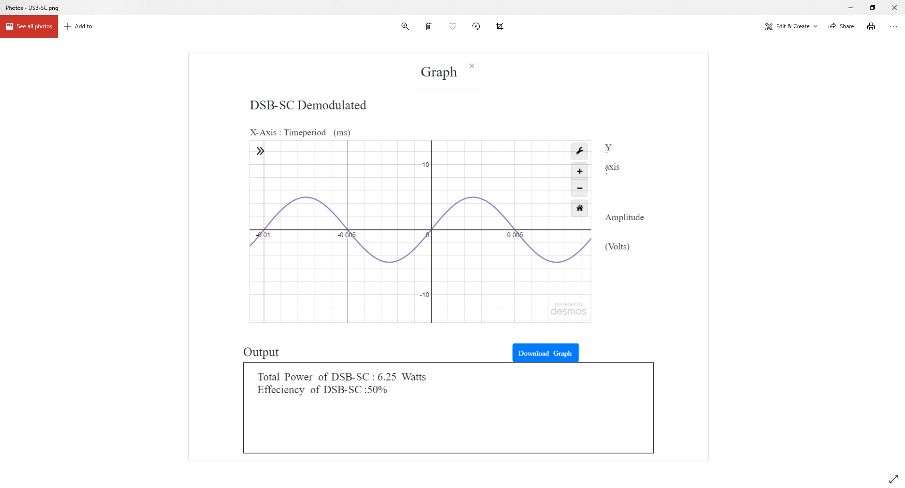

