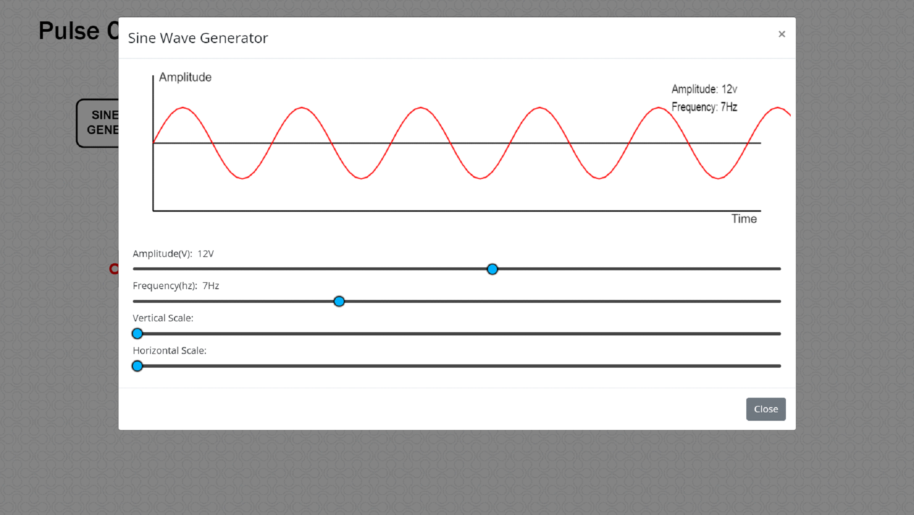
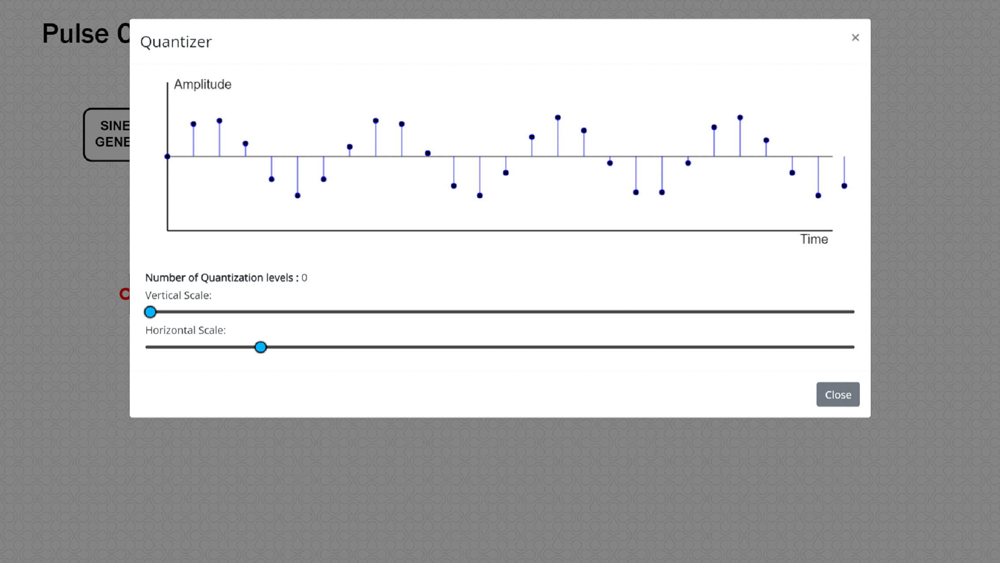
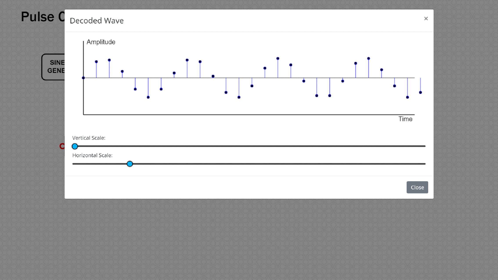

# StoryBoard

#### Proposal ID : NITK_PALS_22_017_05

#### Experiment Name : ***Pulse Code Modulation and Demodulation***

#### Story Outline:
##### **Pulse code modulation (PCM) is a type of analog to digital (A/D) conversion technique in which the input analog signal is sampled at regular intervals and the information in each sample is represented in digital form. The goal of this experiment is to understand the basic principle of pulse code modulation (PCM) and demodulation and how well the analog signal at the transmitter is converted into n-bit binary (digital) using a sampler, quantizer and encoder. Sampling is the process of converting continuous time signals into discrete time signals. The continuous amplitude signal is converted into discrete amplitude signal by means of quantizer and the signal discrete in both time and amplitude into digital using encoder. The baseband signal at the receiver is retrieved from the encoded binary data by using decoder and reconstruction filter. The required transmission bandwidth, signaling rate, step size and signal to quantization noise ratio (SQNR) are examined to evaluate the performance of the PCM system.**

#### Story:

##### **The simulator workspace comprises the blocks such as sine wave generator, sampler, quantizer, encoder, decoder, reconstruction filter and evaluate block. The position of the blocks are static and wires are to be connected by the user as per the block diagram to perform pulse code modulation and demodulation. The user has to set the amplitude and frequency parameters of input blocks to perform the simulation and view the output of pulse code modulation and demodulation. The parameters such as Transmission Bandwidth, step size, signaling rate and signal to quantization noise ratio can be observed using the “Evaluate” block.**

#### Set User Objectives & Goals:

##### **1) State the principle of pulse code modulation and demodulation**
##### **2) Recall sampling, quantization, encoding and decoding process for analog to digital conversion.**
##### **3) Calculate the required transmission bandwidth and signaling rate of PCM signal.**
##### **4) Analyze the performance of the PCM system by varying the frequency and amplitude of the input baseband signal.**
##### **5) Evaluate signal to quantization ratio (SQNR) of PCM signal to analyze the efficacy of PCM.**

#### Pathway activities:

##### 1) Students should click on the theory icon to browse through the theory and procedure for simulating Pulse Code Modulation and Demodulation.
##### 2) The user should next connect the blocks as per the block diagram. This is done by clicking the connection points (red circles on every block) in the correct order.
##### 3) Double click the sine wave generator block to set the amplitude and frequency of the input signal.
##### 4) Double click the sampler block to set the frequency of the sampler(sampling frequency).
##### 5) Double click the quantizer block to view the discrete representation of input sine wave.
##### 6) Double click the encoder block to observe the binary representation of PCM waves for various bit lengths.
##### 7) Double click the decoder block and reconstruction filter block to retrieve the input sine waveform.
##### 8) Double click the “Evaluate” block to view the overall PCM plot and transmission bandwidth, step size, signaling rate and SQNR of the system are observed.
##### 9) Vary the amplitude and frequency of input sine wave and sampling frequency to observe the simulated result for various input parameters.
##### 10) Calculate the parameters such as transmission bandwidth, step size, signaling rate and SQNR for the proposed circuit and compare the same with the simulation generated values.

#### Set Challenges and Questions/Complexity/variation
### **Pre Test Section :**

#### **Note**:
##### ***These questions are asked to examine the Theoretical knowledge absorbed by the user  during the theory class.***
##### ***Please do answer all the questions below within the allocated time to avoid any errors.***

##### Number of Questions : 5
##### Question Pattern: MCQ

#### **Quick Quiz**
##### 1.	Identify the suitable digital pulse modulation which represent the signal in the form of sequence of coded pulses.?
 A.	AM

 B.	FM

 C.	PM

 ***D.	PCM***

##### 2.	Calculate the signal to quantization noise ratio of 7- bit PCM system for the message bandwidth of 500 Hz.
 A.	53.8 dB

 ***B.	43.8 dB***

 C.	63.8 dB

 D.	33.8 dB

##### 3.	What is the drawback of PCM ?
 A.	Increased delay

***B. Increased bandwidth***

 C.	Analog Output

 D.	Digital Output

#####  4.	Find the transmission bandwidth and signaling rate of 9- bit PCM for the message bandwidth of 800Hz.
 ***A.	7.2KHz, 14.4Kbps***

 B.	8KHz,16Kbps

 C.	6kHz, 3Kbps

 D.	9.2 KHz, 9.2Kbps

##### 5.	Identify the block in PCM which converts continuous amplitude samples into discrete amplitude samples.
 A.	Sampler

 B.	Encoder

 ***C.	Quantizer***

 D.	Repeater

### **Post Test Section**
#### **Note**:
##### ***These questions are asked to check the knowledge attained by the user after performing the experiment.***
##### ***Please do answer all the questions below within the allocated time to avoid any errors.***

##### Number of Questions: **5**
##### Question Pattern: MCQ

#### **Quick Quiz**

##### 1. Arrange the sequence of operations performed in transmitter part of a PCM system
 A.	Decoder, Sampler, Quantizer

 B.	Quantizer, Filter, Sampler 

 C.	Encoder, quantizer, Sampler 

 ***D.	Sampler, Quantizer, Encoder***

##### 2. What is the transmission bandwidth of n- bit PCM for the message bandwidth of “w” Hz?

 A.	BT=4nw 

 B.	BT=nw/2

 C.	BT=2nw 

 ***D.	BT=nw***

##### 3. Define PCM.
 ***A.	Each message sample is converted into n-bit binary.***

 B.	Each message sample is converted into analog.

 C.	Each message sample is converted into discrete. 

 D.	Each message sample is converted into sinewave.

##### 4. Calculate the signal to quantization noise ratio in dB for a 10-bit PCM system. 

  
 A. 23.8 dB 

 ***B. 61.8 dB***

 C. 72.6 dB

 D. 56.3 dB

##### 5. Obtain the codeword length of a sample which is quantized into one of 16 levels in PCM. 

 A.    5

 ***B.     4***

 C.      3

 D.      7

#### Conclusion:

**By doing the above experiment the user would get familiarized with the concept of pulse code modulation and demodulation.**
##### **Time required to perform the virtual experiment.**
**The approximate time required to understand the procedure to perform the  experiment would take about 5 min. To connect all the different blocks and to set the input parameter for modulation & demodulation will take another 7 min. Analyzing the output with theory calculations will take 5 min. Answering the assessment questions will take about 5 min. The total time needed to perform the experiment is around 22 mins.**

#### Equations/formulas:

| **Theory**     | **Formulae** |   **Description**|
| :-----------: | :------------: | :-----------: |
|**Transmission Bandwidth, Bt (Hz)**     | **Bt = nW**  |   **n🡪 number of bits/sample, W🡪 Message Bandwidth**|
| **Step Size, S (V)**   | **S=(2*Amax)/L**      |       **Amax🡪  Maximum Amplitude of the input signal, L🡪 Number of quantization levels**|
| **Signaling Rate, r (bits/sec)**   | **r = 2nW**      |       **n🡪 number of bits/sample, W🡪 Message Bandwidth**          |
| **Signal to quantization noise ratio, SQNR (dB)**   | **SQNR = 1.8 + 6n**      |       **n🡪 number of bits/sample**          |

#### Flowchart:

#### Mindmap:

## **Storyboard:**
### **Procedure:**
##### **Equipment’s/Components Required:**

|    **Name of equipment/component**   | **Quantity required/used** |
| :---:        |    :----:   |  
| **1)Sinewave Generator Block**     | **1**      |
| **2) Sampler Block**   | **1**       |
| **3) Quantizer Block**   | **1**       |
| **4) Encoder Block**   | **1**       |
| **5) Decoder Block**   | **1**       |
| **6) Reconstruction Filter Block**   | **1**       |
| **7) Evaluate Block**   | **1**       |

#### **Step by Step Procedure to perform experiment**

##### **Step 1** : *The user should click on the theory under which the concept behind the working of the experiment would be displayed followed by the procedure on the screen. The user should perform the experiments based on the guidelines listed under the procedure.*

#####  **Step 2** : *The required blocks are statically positioned. Click on any one connection point to initiate the wire connection and click on another connection point to complete the connection. Clicking on any part of the simulation canvas after initiating a wire will cause the wire to be anchored to that point. Connect all the blocks in the right order.*

##### *Once all the connections are made as per the block diagram, the simulator screen will look like*

##### **Step 3** : *Double click the SINE WAVE GENERATOR block and set the amplitude (V) and frequency (Hz) of the input sinusoidal wave.*

##### **Step 4** : *Double click the SAMPLER block and set the frequency (Hz) of the sampler (Sampling Frequency).*

##### **Step 5** : *Double click the Quantizer block to view the number of quantization levels and the discrete version of the input signal.*

##### **Step 6** : *Double click the ENCODER block to observe the binary representation of input sine wave and analyze the PCM wave for various bit lengths.*

##### **Step 7** : *Double click the DECODER block to observe the decoded PCM wave. This waveform resembles that of the QUANTIZER output.*

##### **Step 8** : *Double click the RECONSTRUCTION FILTER block to reconstruct the message signal from the decoded signal.*

##### **Step 9** : *Double click the Evaluate block to observe all the Pulse Code Modulation and Demodulation plots and verify the simulation PCM parameters such as step size, Transmission Bandwidth,signaling rate and signal to quantization noise ratio.*

##### **Step 10** : *Vary the parameters of input blocks and observe the simulated PCM output for the same.*