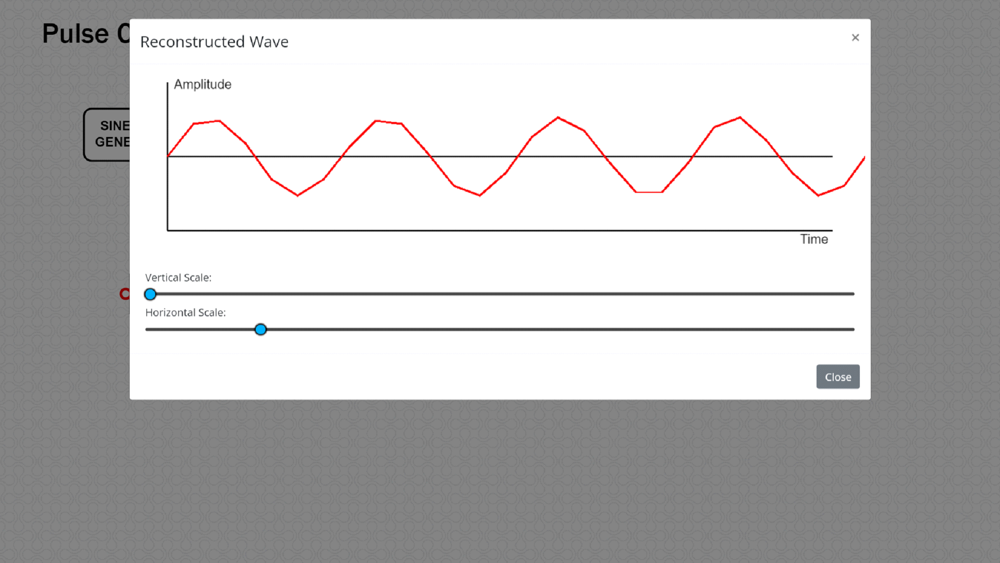
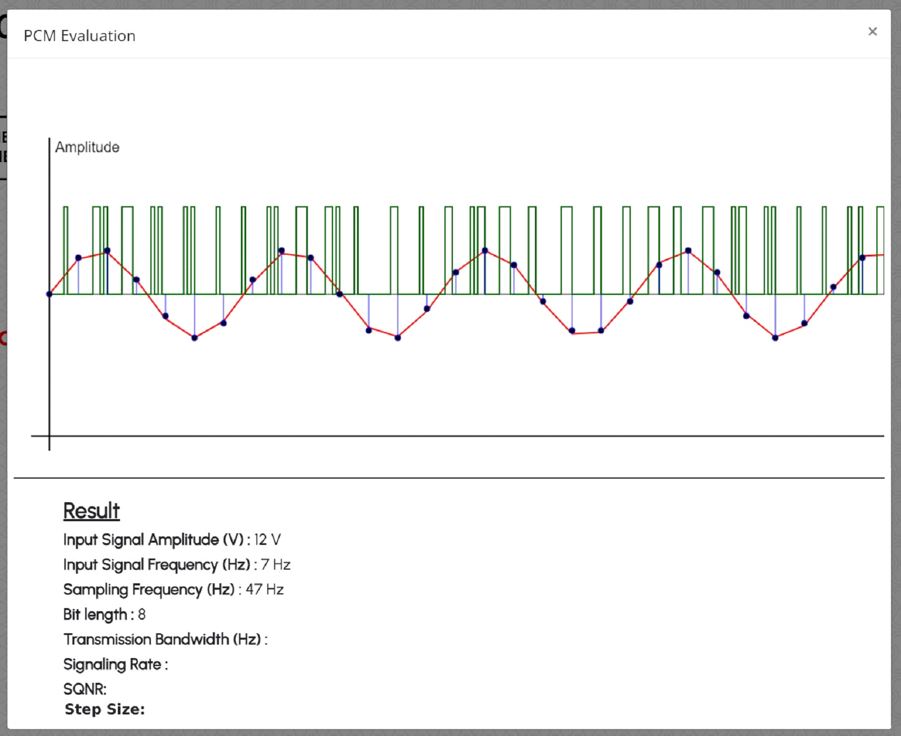

### **Procedure:**

##### **Equipment’s/Components Required**

|   **S. No.**   |    **Name of equipment/component**   | **Quantity required/used** |
| :---:        | :---:        |    :----:   |  
| **1** | **Sine Wave Generator block**     | **1**      |
| **2** | **Sampler block**   | **1**       |
| **3** | **Quantizer block**   | **1**       |
| **4** | **Encoder block**   | **1**       |
| **5** | **Decoder block**   | **1**       |
| **6** | **Reconstruction Filter block**   | **1**       |
| **7** | **Evaluate Block**   | **1**       |

#### **Step by Step Procedure to perform Pulse Code Modulation experiment:**

##### **Step 1 :** The user should click on the theory under which the concept behind the working of the experiment would be displayed followed by the procedure on the screen. The user should perform the experiments based on the guidelines listed under the procedure.

#####  **Step 2 :** The required blocks are statically positioned. Click on any one connection point to initiate the wire connection and click on another connection point to complete the connection. Clicking on any part of the simulation canvas after initiating a wire will cause the wire to be anchored to that point. Connect all the blocks in the right order.

##### Once all the connections are made as per the block diagram, the simulator screen will look like

#####  **Step 3 :** Double click the SINE WAVE GENERATOR block and set the amplitude (V) and frequency (Hz) of the input sinusoidal wave.

#####  **Step 4 :** Double click the SAMPLER block and set the frequency (Hz) of the sampler (Sampling Frequency).

#####  **Step 5 :** Double click the Quantizer block to view the number of quantization levels and the discrete version of the input signal.

#####  **Step 6 :** Double click the ENCODER block to observe the binary representation of input sine wave and analyze the PCM wave for various bit lengths. 

#####  **Step 7 :** Double click the DECODER block to observe the decoded PCM wave. This waveform resembles that of the QUANTIZER output. 

#####  **Step 8 :** Double click the RECONSTRUCTION FILTER block to reconstruct the message signal from the decoded signal. 

#####  **Step 9 :** Double click the Evaluate block to observe all the Pulse Code Modulation and Demodulation plots and verify the simulation  PCM parameters such as step size, Transmission Bandwidth,signaling rate and signal to quantization noise ratio.  

##### **Step 10 :** Vary the parameters of input blocks and observe the simulated PCM output for the same.