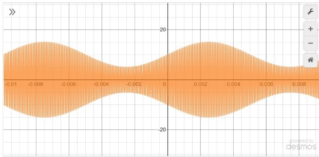
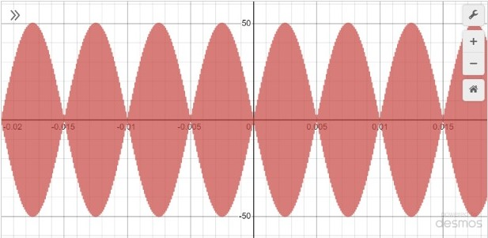
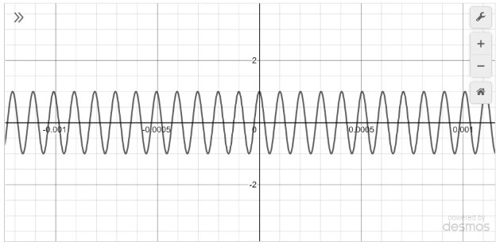

##### **Theory:**

### Concept

#### **Introduction**
**Modulation is the process of  transmitting low frequency message signal  over a high frequency carrier signal. In amplitude modulation, the amplitude of the carrier wave is varied in proportion to the amplitude of the message signal (modulating signal). The amplitude modulated signal consists of carrier with two sidebands namely Upper Side band(USB) and Lower Side Band(LSB) , which is known as "Double Side Band with Full Carrier System".**

#### **The Types of Amplitude Modulation**
**The most common forms of amplitude modulation techniques are as follows:**

#### 1) DSB-FC -“Double Sideband with Full Carrier System”/Standard AM ,
#### 2) DSB-SC – “Double Sideband with Suppressed Carrier System”,
#### 3) SSB – “Single Side Band System”

#### 1)**Double Sideband with Full Carrier System(DSB-FC)**
##### Introduction
**The modulated signal which includes the carrier component  along with two side bands namely USB & LSB (USB contains higher frequency components, whereas the (LSB) has lower frequency components with reference to carrier frequency ) is known as a Double Sideband with Full Carrier system, or simply DSB-FC. In DSB-FC both the  sidebands carry the same information. The graphical representation of DSB-FC modulated signal is illustrated below.**

#### **DSB-FC Waveform**

 ***Note: The modulation index μ  ranges from  0 to 1 for effective reconstruction at the receiver.***

##### Demodulation
**The modulated signal is passed through  an envelope detector, which consists of a Halfwave Rectifier and an RC Filter that would detect the envelop of the modulated signal  and retrieve the message signal from the DSB-FC modulated signal.**

##### Advantages
**1) The receiver is  simple and inexpensive.**

##### Disadvantages
**1) Wastage of power & bandwidth is more .**

**2) Overall efficiency is low (about 33 percent).**

#### 2)**Double Sideband with Suppressed Carrier System(DSB-SC)**
##### Introduction
**DSB-SC system consists only of two sidebands namely USB ,LSB in the absence of carrier signal. The carrier signal and the message signal are sent via a product modulator/balanced modulator to create DSB-SC modulated signal. The graphical representation of DSB-SC modulated signal is illustrated below.**

#### **DSB-SC Waveform**

 ***Note: The bandwidth of the DSB-SC modulated signal is twice the bandwidth of the message signal.***

##### Demodulation
**The DSB-SC modulated signal is henceforth multiplied  with the carrier signal using product modulator and the resultant  signal is passed through a low pass filter (LPF) to attenuate the high frequency components of the modulated signal and enable just the low frequency components (message signal) to pass through.**

##### Advantages
**1) Simple Modulation technique.**

**2) Sidebands do not require filtering during this type of modulation.**

**3) Power wastage is less compared to DSB-FC for this modulation scheme**

##### Disadvantages
**1) It contains less carrier information about the carrier.**

**2) Detection process is complex.**

**3) More bandwidth than SSB.**

#### 3)**Single Sideband Suppressed Carrier System(SSB-SC)/(SSB)**
##### Introduction
**In Single sideband system  only a single sideband either USB or LSB is broadcast by an antenna where the carrier and the other sideband is suppressed . The DSB-SC modulated signal  is passed through a Bandpass filter which results in SSB modulated signal. The graphical representation of SSB modulated signal is illustrated below.**

#### **SSB-SC Waveform**

 ***Note: The bandwidth of the SSB signal is equal to the bandwidth of the message signal.***

##### Demodulation
**The SSB modulated signal is henceforth multiplied  with the carrier signal using product modulator and the resultant  signal is passed through a low pass filter (LPF) to attenuate the high frequency components of the modulated signal and enable just the low frequency components (message signal) to pass through.**

##### Advantages
**1) The bandwidth of SSB signal is same as the bandwidth of the message signal.**

**2) This modulation technique only  transmits one sideband, and hence as a result  half the power is saved.**

##### Disadvantages
**1) In this modulation technique, filtering of one sideband is difficult and hence adds to the transmitter circuit's complexity.**

**2) A bandpass filter with an extremely sharp cutoff is required to perform this type of modulation.**

##### **Function of the equipment's  required to perform Amplitude Modulation/Demodulation for each type.**
##### **A)Transmitting side**

##### **1)Wave generator:**

**This is the input blocks of the transmitter component, where one of the wave generator is used  for message signal generation whereas the other  is used  for carrier wave generation.**
**Note :User must set the amplitude and frequency in order to initiate the modulation process.**

##### **2)Balanced modulator:**

**Balanced modulator is a product modulator which accepts message and carrier signals as the inputs and deliver the DSB-SC as output.**

##### **3)Adder:**

**The Adder accepts a DSB-SC signal and  carrier signal  as input and produce DSB-FC waveform.**

##### **4)Side Band Suppress Filter (SSBF):**

**A Side Band suppress filter is basically a band pass filter where the function of the Side Band filter is to suppress the one of the sidebands  in the DSB-SC signal which is fed as input and  results in a single sideband signal.**

##### **B) Receiver  side**

##### **1)Envelope Detector:**
**This is a combination of the halfwave Rectifier function and the RC-Filter function in which the main purpose of this block is to identify the message signal component from the DSB-FC modulated signal and extract the same.**

##### Note: The equivalent of the Half wave rectifier block in cascade with an RC-Filter would be an Envelop Detector Block.

##### **2)DSB-SC Demodulator:**
**This is a predefined block which is used to identify the message signal component from the DSB-SC modulated signal and extract the same.**

##### **3)SSB Demodulator:**
**This is a predefined block which is used to identify the message signal component from the SSB-modulated signal and extract the same.**

#### **Disadvantages of Amplitude Modulation**

**1) Wastage of power & Bandwidth is high**

**2) Effect of Noise and Interference is more**

#### **Practical Applications of Amplitude Modulation**

**1) Am Broadcasting**

**2)Airborne applications**

#### Equations/formulas:

| **Theory**     | **Formulae** |   **Description**|
| :-----------:| :--------------: | :-----------:|
|**Total power/Modulation Index Calculation for DSB-FC:**     | **1)Pt=Pc[1+(mu x mu)/2]**,**2)N=[(mu x mu)/2+(mu x mu)]**  |   **Pc🡪 Carrier signal Power,Pt🡪 Total Power of DSB-FC Signal,mu🡪 Modulation Index,N 🡪Efficiency**|
| **Total power /Modulation Index Calculation for DSB-SC:**   | **Pt’=[(mu x mu)  x (VC x VC)]/4=>Pc x (mu x mu)/2,N= [2/2+(mu x mu)]**      |       **Pc🡪  Carrier signal Power,Pt’🡪 Total Power of DSB-SC Signal,mu🡪 Modulation Index,N 🡪Efficiency**|
| **Total power/Modulation Index Calculation for SSB/SSB-SC:**   | **Pt’’=[(mu x mu)  x (VC x VC)]/8=>Pc x (mu x mu)/4,N=[4+(mu x mu)/4+(2 x (mu x mu))]**      |       **Pc🡪  Carrier signal Power,Pt’🡪 Total Power of DSB-SC Signal,mu🡪 Modulation Index,N 🡪Efficiency**          |

#### Flowchart:

