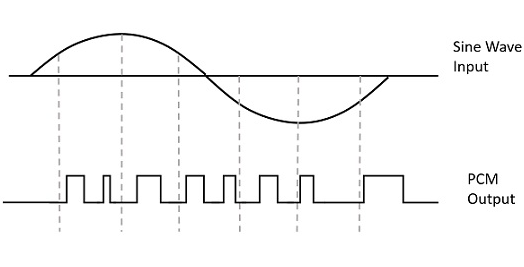
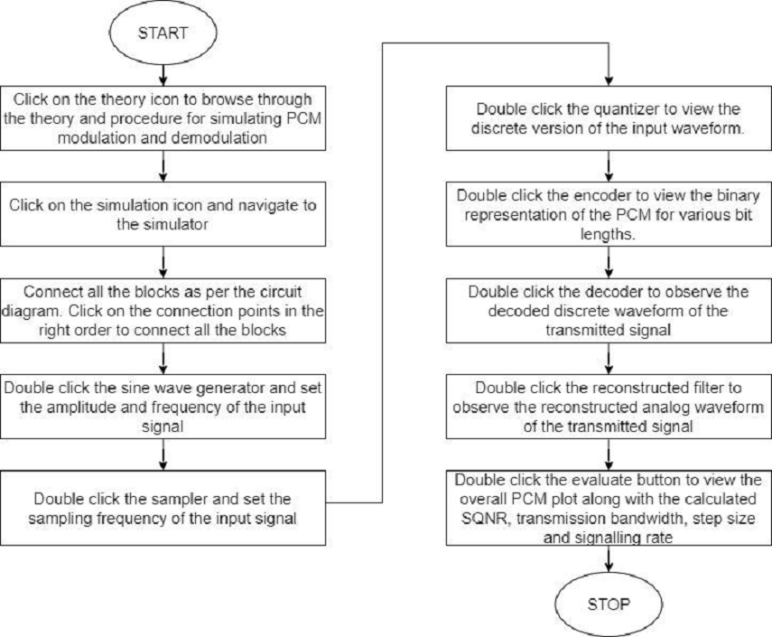

## Theory :

### Concept

#### **Introduction**
###### Pulse code modulation (PCM) is a waveform coding technique used to represent the speech signal into a sequence of coded pulses.  PCM converts the analog signal into a signal which is discrete in both time and amplitude. The three basic elements of PCM are sampler, Quantizer and encoder. The input analog signal is bandlimited using a low pass filter prior to sampling in order to avoid aliasing effect. Sampling is the process of converting continuous time signal into discrete time signal.  The analog signal is instantaneously sampled with a train of narrow rectangular pulses. The sampling rate should be greater than twice the highest frequency of the input analog signal for perfect reconstruction at the receiver.  The continuous amplitude signal is converted into discrete amplitude signal by means of quantizer. The types of quantizer are uniform and non-uniform. The representation levels are uniformly spaced in uniform quantizer and the step size remains the same throughout the signal range.  The quantization error can be controlled by varying the step size. The signal discrete in both time and amplitude is converted into digital using an encoder.  The decoder coverts the coded pulses into quantized pulse amplitude modulated (PAM) signal and the low pass reconstruction filter at the receiver with a cut off frequency equal to the message bandwidth is used to retrieve the baseband signal from the quantized PAM.

###### The goal of this experiment is to understand the basic principle of pulse code modulation (PCM) and demodulation and how well the analog signal at the transmitter is converted into n-bit binary digital) using sampler, quantizer and encoder. The required transmission bandwidth, signaling rate, step size and signal to quantization noise ratio (SQNR) are examined to evaluate the performance of the PCM system.

#### **The Types of Pulse Code Modulation**

###### 1) Differential Pulse Code Modulation ( DPCM )
###### 2) Adaptive differential pulse code modulation ( ADPCM )
###### 3) Delta Modulation (DM)

#### 1) Differential Pulse Code Modulation ( DPCM )
###### In DPCM, the difference between the successive sample values are quantized and encoded into binary. The sampling rate chosen for DPCM is slightly higher than the Nyquist rate as in PCM in order to produce the highly correlated samples. The basic principle of DPCM is by removing the redundancy prior to encoding and to produce an efficient coded signal. The difference between the input sample and the prediction filter output is encoded into binary. By using the same prediction filter at the receiver, the analog signal is reconstructed from the decoder output.

#### 2) Adaptive differential pulse code modulation ( ADPCM )
###### ADPCM offers speech coding at low bit rates without compromising the quality of reproduction. The principle behind ADPCM is by removing the redundant information from speech signal as far as possible and encode the non-redundant parts of the speech signal into binary. It uses adaptive quantization and adaptive prediction to save the bandwidth and reduce the bit rate. 

#### 3) Delta Modulation ( DM )
###### In Delta modulation (DM), each sample is encoded into single bit either ‘0’ or ‘1’. The sampling rate of is much higher than the Nyquist rate to increase the correlation between the successive samples. It provides the staircase approximation to the sampled version of input analog signal. The difference between the input and the approximation is quantized and encoded into two levels corresponding to the positive and negative differences.

#### **Function of the equipment's  required to perform Pulse Code Modulation/Demodulation for each type.**

##### Sine wave generator:
###### This block is used to generate the sinusoidal input signal of frequency ‘fm’ Hz and amplitude ‘A’ volts. 
##### Sampler:
###### The input analog signal is converted into discrete time signal using a sampler block. The narrow rectangular pulses produced by sampler is used to vary the number of samples in an analog signal. The sampling frequency produced by this block is greater than twice the input analog signal frequency ‘fm’. 
##### Quantizer:
###### The discrete time signal from the sampler is converted into discrete amplitude signal using quantizer block. The number of levels in the quantizer and the maximum amplitude of the input signal defines the step size. 
##### Encoder:
###### The discrete time and amplitude signal is converted into digital by encoder block. It produces the ‘n’-bit binary equivalent of the input sample value. The number of bits at the encoder output determines the signal to quantization noise ratio of PCM system.
##### Decoder:
###### The PCM wave is converted into quantized PAM using this block. It converts digital data into discrete time- amplitude signal. 
##### Reconstruction filter:
###### Reconstruction filter is the low pass filter with a cut off frequency of ‘fm’ Hz. It allows the analog signal of frequency ‘fm’ and discard all the high frequency components.
##### Evaluate:
###### This block is used to analyse the PCM parameters such as step size, transmission bandwidth, Signaling rate and signal to quantization noise ratio (SQNR) for the input signal. 

#### **Advantages of Pulse Code Modulation**
###### 1) Less effect of channel noise and interference.
###### 2) Efficient regeneration of the coded signal.
###### 3) Uses Uniform format for transmission.
###### 4) Secure communication.

#### **Disadvantages of Pulse Code Modulation**
###### 1) System complexity is more.
###### 2) Increased bandwidth. 

#### **Practical Applications of Amplitude Modulation**
###### 1) Telephony.
###### 2) Satellite communication system.

#### Equations/formulas:

| **Theory**     | **Formulae** |   **Description**|
| :-----------:| :--------------: | :-----------:|
|**Total power/Modulation Index Calculation for DSB-FC:**     | **1)Pt=Pc[1+(mu x mu)/2]**,**2)N=[(mu x mu)/2+(mu x mu)]**  |   **Pc🡪 Carrier signal Power,Pt🡪 Total Power of DSB-FC Signal,mu🡪 Modulation Index,N 🡪Efficiency**|
| **Total power /Modulation Index Calculation for DSB-SC:**   | **Pt’=[(mu x mu)  x (VC x VC)]/4=>Pc x (mu x mu)/2,N= [2/2+(mu x mu)]**      |       **Pc🡪  Carrier signal Power,Pt’🡪 Total Power of DSB-SC Signal,mu🡪 Modulation Index,N 🡪Efficiency**|
| **Total power/Modulation Index Calculation for SSB/SSB-SC:**   | **Pt’’=[(mu x mu)  x (VC x VC)]/8=>Pc x (mu x mu)/4,N=[4+(mu x mu)/4+(2 x (mu x mu))]**      |       **Pc🡪  Carrier signal Power,Pt’🡪 Total Power of DSB-SC Signal,mu🡪 Modulation Index,N 🡪Efficiency**          |

#### Flowchart:

