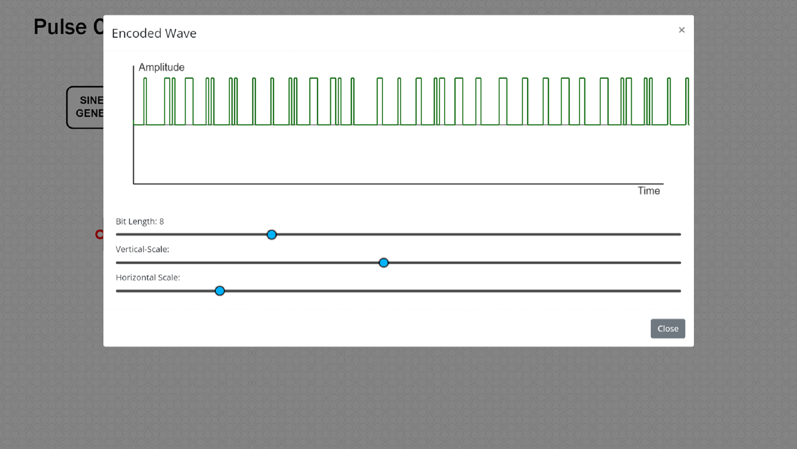

# **Pedagogy**
##### ***Name of the Developers:***
##### Niteesh Babu.G.S, Sayad Pervez B.

#####  ***Institute:***
##### **Rajalakshmi Engineering College**

##### ***Email id:***
##### 1) niteeshbabu.gs.2018.ece@rajalakshmi.edu.in
##### 2) sayadpervez.b.2019.ece@rajalakshmi.edu.in

##### **Department:** ***ECE***

##### **Discipline:** ***ECE***

##### Name of the Lab: **Communication Systems Laboratory(C.S.L)**

##### Name of experiment: ***Pulse Code Modulation and Demodulation***

##### Focus Area :  Experimental Analysis Method

#### About the experiment:
##### **The goal of this experiment is to understand the basic principle of pulse code modulation (PCM) and demodulation and how the analog signal at the transmitter is converted into n-bit binary (digital) using sampler, quantizer and encoder. At the receiver, the baseband signal is retrieved from the encoded binary data by using decoder and reconstruction filter. The required transmission bandwidth, signalling rate and signal to quantization ratio (SQNR) are examined to analyse the performance of PCM system.**

#### 1.	Learning Objectives and Cognitive Level:
| **No**    | **Learning& Objectives** | **Cognitive Level**     | **Action Verb**|
| :---:        |    :----:                 | :----:                  |:----:           |
| **1**       | **Students will be able to define pulse code modulation.**| **Remember**           |       **Define**         |
| **2**         | **Students will be able to define the process of sampling, quantization, encoding and decoding for pulse code  modulation and demodulation**                      | **Remember**               |       **Define**         |
| **3**         | **Students will be able to calculate the required transmission bandwidth and signalling rate of PCM signal**                    | **Apply**                |     **Calculate**           |
| **4**         | **Students will be able to analyse the performance of PCM by varying the frequency and amplitude of the input baseband signal**                      | **Analyse**               |      **Analyse**          |
| **5**         | **Students will be able to evaluate the signal to quantization ratio (SQNR) of   n-bit binary at the PCM output**                      | **Evaluate**               |      **Evaluate**          |

#### 2. Instructional Strategy:
#####  2. 1 Instructional Strategy:  Experiential Learning
#####   2.2 Assessment Method: Formative Assessment, Pretest and Posttest (Multiple choice questions)
#####   2.3 Description of section:
##### •	Theory aspects for the proposed PCM experiment will be provided for better understanding.
##### •	Step by step procedure to perform the simulation will be given.
##### •	Pretest questions (based on the concept of PCM) & post test questions (based on the observations carried out) will be provided to evaluate the students understanding level.
##### •Additional reference materials related to pulse code modulation and demodulation will be provided.

#### 3. Task & Assessment Questions:

| **No**    | **Instructions given by the Teacher**| **Tasks to be done by the Students**     |**Assessment questions aligned to the task**|**Assessment questions Solutions**|
| :---       |    :----  |          :--- |  :---|:---|
| **1**     | **State the principle of  Pulse code modulation and demodulation.**     | **Click on the theory button to understand the basic principle of pulse code modulation and demodulation**   |   **Conceptual question (to be asked by teacher): Define Pulse Code Modulation.**      |   **Each message sample is converted into n-bit binary.**  |
| **2**|**State the basic elements of PCM and its process.**   | **Click on the procedure button and see the blocks present in the simulator to understand the basic elements of PCM.**        | **Arrange the sequence of operations performed in transmitter part of a PCM system**      |**Arrange the sequence of operations performed in transmitter part of a PCM system**|
| **3**     | **Choose the appropriate values of frequency and amplitude of input sine wave and sampling signal and calculate the theoretical values of transmission bandwidth and signalling rate of PCM.**     | **Click on the Sine wave generator and Sampler blocks to set the suitable values of input sine wave and sampling frequency to perform PCM experiment and compute the parameters.**   |   **What is the transmission bandwidth of n- bit PCM for the message bandwidth of “w” Hz?**      |   **BT = nW**  |
| **4**   | **Examine the performance of PCM system by repeating the experiment using different set of frequency and amplitude values.**        | **Click on the blocks to reconstruct the PCM circuit for a new set of values and execute the simulator to analyse the output waveforms of the respective blocks and compute the PCM parameters.**      |**Obtain the codeword length of a sample which is quantized into one of 16 levels in PCM.**|**4**|
| **5**     | **Calculate the output signal to quantization noise ratio (SQNR) for the n-bit binary at the PCM output and verify it with the simulated result.**     | **Click on the Evaluate block at the modulator to obtain the values of SQNR, transmission bandwidth and signalling rate of n-bit PCM for the message bandwidth of “w” Hz.**   |   **Calculate the signal to quantization noise ratio in dB for a 10-bit PCM system.**      |   **61.8 dB**  |

#### 4. Simulator Interactions:

| **No**      | **What students will do?** | **What Simulator will do?**     |**Conclusion of the task**|
| :---        |    :------   |      :--------- | :---|
| **1**      | **Click on the theory under which the concept behind the working of the experiment would be displayed followed by the procedure on the screen. The user should perform the experiments based on the guidelines listed under the procedure.**      | **Shows the theory and procedure to be followed to simulate the experiment**  |**Identify the functionality and objectives of the experiment.**|
| **2**  | **Understand the blocks required to build the circuit in the workspace.**        | **Display the blocks required to perform the experiment.**      |**To realize the theoretical concepts in the simulation environment.**|
| **3**     | **Click on any one connection point to initiate the wire connection and click on another connection point to complete the connection. Clicking on any part of the simulation canvas after initiating a wire will cause the wire to be anchored to that point. Connect all the blocks in the right order.**      | **Connect 2 blocks in the workspace.** |**Understand how to connect 2 blocks in the workspace.**|
|**4**   |**Double click the SINE WAVE GENERATOR block and set the amplitude (V) and frequency (Hz) of the input sinusoidal wave.**         | **Display the SINE WAVE GENERATOR control panel.**     | **To set the input signal characteristics.**|
| **5**     | **Double click the SAMPLER block and set the frequency (Hz) of the sampler (Sampling Frequency).**      | **Display the SAMPLER control panel.**   | **To set the sampler characteristics.**|
| **6**   | **Double click the Quantizer block to view the number of quantization levels and the discrete version of the input signal.**        | **Display the Quantizer control panel.**      | **To set the sampler characteristics.**|
| **7**   | **Double click the ENCODER block to observe the binary representation of input sine wave and analyze the PCM wave for various bit lengths.**        | **Display the Encoder control panel.**      | **To set the encoder characteristics.**|
| **8**   | **Double click the DECODER block to observe the decoded PCM wave. This waveform resembles that of the QUANTIZER output.**        | **Display the Decoder control panel.**      | **To observe the decoded wave.**|
| **9**   | **Double click the RECONSTRUCTION FILTER block to reconstruct the message signal from the decoded signal.**        | **Display the Reconstruction Filter control panel.**      | **To observe the reconstructed wave.**|
| **10**   | **Double click the Evaluate block to observe all the Pulse Code Modulation and Demodulation plots and verify the simulation  PCM parameters such as step size, Transmission Bandwidth, signalling rate and signal to quantization noise ratio.**        | **Display the Evaluation control panel.**      | **To observe the results of all the stages of the experiment.**|

#### Simulator Workspace and Workflow:
##### Simulator Workspace:

##### SINE WAVE GENERATOR Control Panel:

##### Sampler Control Panel:

##### Quantizer Control Panel:

##### Encoder Control Panel:

##### Decoder Control Panel:

##### Reconstruction Filter Control Panel:

##### Evaluation Control Panel:

